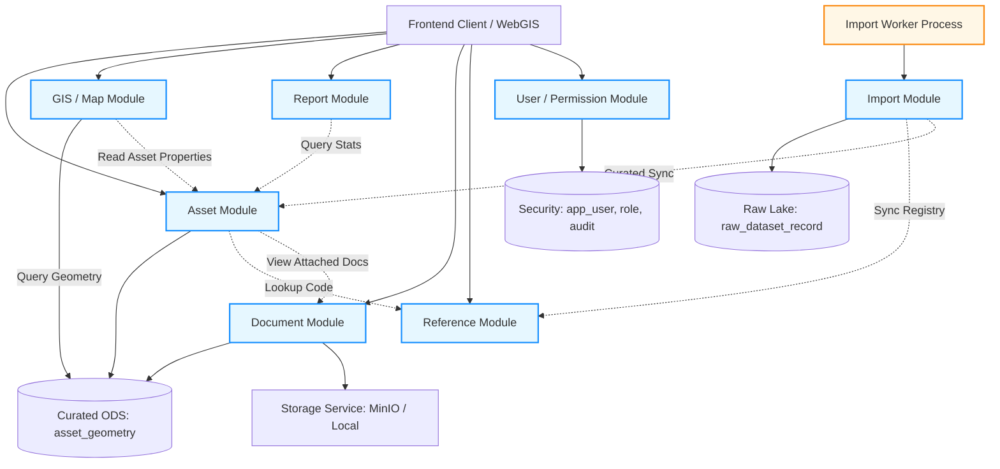

# QUY TẮC PHỤ THUỘC GIỮA CÁC MODULE (MODULE_DEPENDENCY_RULES)
**Dự án: Hệ thống Quản lý Kết cấu Hạ tầng Giao thông Đường bộ (KCHT ĐB)**  
**Cơ quan chủ quản:** Cục Đường bộ Việt Nam  
**Phiên bản:** 1.0.0 (Giai đoạn 1 - Khởi tạo Monorepo và Môi trường Local)

---

## 1. NGUYÊN TẮC CỐT LÕI (ARCHITECTURAL INVARIANTS)

1. **Ranh giới Bất khả xâm phạm (Boundary Isolation):** Mỗi module nghiệp vụ sở hữu package, Entity, Repository, Service và API Controller riêng. Module A **tuyệt đối không được tiêm (inject)** Repository hoặc Entity của Module B vào code của mình.
2. **Giao tiếp qua Port / Application Service:** Khi Module A cần dữ liệu từ Module B, giao tiếp bắt buộc phải thông qua **Public Service Interface (Port)** hoặc **Spring Application Events** nội bộ.
3. **Không Phụ thuộc Vòng (Strictly No Circular Dependencies):** Sơ đồ phụ thuộc giữa các module phải là Đồ thị có hướng không chu trình (Directed Acyclic Graph - DAG).
4. **Shared Kernel Tinh gọn:** Package `shared` chỉ chứa các lớp dùng chung bất biến: Value Objects, DTO phân trang (`PagedResponse`), chuẩn lỗi (`ErrorResponseDto`, Exception classes), và Utilities. Không đặt logic nghiệp vụ vào shared kernel.

---

## 2. MA TRẬN PHỤ THUỘC ĐƯỢC PHÉP GIỮA CÁC MODULE

### Bảng Ma trận Chi tiết:

| Module Gọi (Caller) | Module Được Phép Gọi (Allowed Dependencies) | Module CẤM Gọi Trực Tiếp (Forbidden) | Hình thức Giao tiếp Được Phép |
| :--- | :--- | :--- | :--- |
| **`Asset Module`** | `Reference Module` (tra cứu mã), `Document Module` (metadata hồ sơ), `Shared Kernel` | `Report Module`, `Import Module`, `User Module` | Port Interface (`CatalogQueryPort`, `DocumentQueryPort`) |
| **`GIS / Map Module`** | `Asset Module` (đọc properties công trình), `Shared Kernel` | `Report Module`, `Import Module`, `Document Module` | Đọc bảng `asset_geometry`, Read-only DTO từ Asset Service |
| **`Report Module`** | `Asset Module` (tổng hợp chiều dài, bảo trì), `Reference Module`, `Shared Kernel` | `Import Module`, `Document Module`, `GIS Module` | Dynamic SQL Views, Read-only Aggregate Queries |
| **`Document Module`** | `Storage Service` (MinIO/Local), `Shared Kernel` | `Asset Module`, `Report Module`, `GIS Module` | Lưu trữ metadata và gọi `StorageService` nhị phân |
| **`Reference Module`** | `Shared Kernel` duy nhất | **CẤM phụ thuộc vào bất kỳ module nghiệp vụ nào khác** | Độc lập hoàn toàn; cung cấp dữ liệu danh mục cho các module khác |
| **`User / Permission Module`** | `Shared Kernel` duy nhất | **CẤM phụ thuộc vào Asset, GIS, Report, Document** | Độc lập hoàn toàn; cung cấp `SecurityContext` và User Profile |
| **`Import Module`** | `Raw Ingestion Store`, `Reference Module`, `Asset Module`, `Document Module` | `GIS UI`, `Report UI` | Chạy nền độc lập; ghi dữ liệu vào CSDL; phát Spring Application Events |

---

## 3. QUY ĐỊNH VỀ IMPORT WORKER ĐỘC LẬP VỚI WEB REQUEST

1. **Tiến trình Độc lập:** Import Worker được đóng gói có thể chạy bằng:
   - Command riêng: `java -jar app.jar --sync-registry` hoặc `--file=assets/tbl_bridge.json`
   - Hoặc Profile riêng: `SPRING_PROFILES_ACTIVE=worker`
2. **Không Gây Khóa Web Request:**
   - Web Request của người dùng không bao giờ chờ tiến trình nạp hoàn thành (không giữ HTTP connection mở).
   - Worker sử dụng Connection Pool riêng hoặc batch transactions để không chiếm dụng pool kết nối của Web API.
3. **Cơ chế Idempotent & Checkpoint:**
   - Worker có thể bị dừng (kill) hoặc restart bất cứ lúc nào mà không làm hỏng dữ liệu (bảo đảm tính toàn vẹn ACID).
