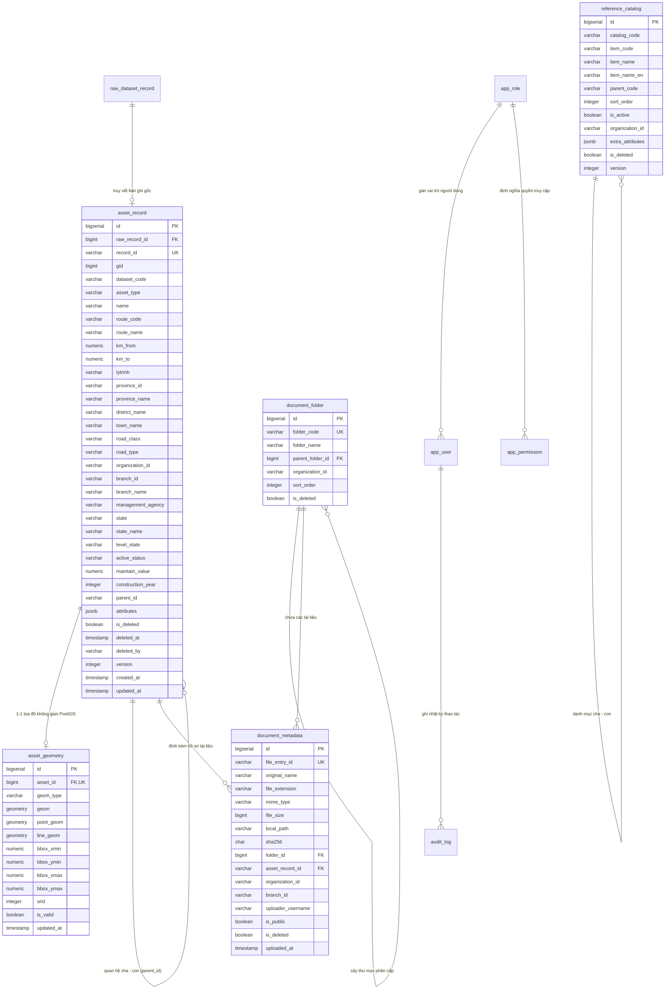

# THIẾT KẾ SCHEMA TẦNG VẬN HÀNH CHUẨN HÓA (CURATED_SCHEMA)
**Hệ thống Quản lý Kết cấu Hạ tầng Giao thông Đường bộ - Cục Đường bộ Việt Nam**

---

## 1. Mục tiêu và Nguyên tắc Thiết kế Tầng Curated / Operational

Tầng Curated (Operational Data Store - ODS) là tầng phục vụ trực tiếp cho người dùng, các API dịch vụ của Spring Boot 3, giao diện WebGIS bản đồ và các báo cáo điều hành của Cục Đường bộ Việt Nam.

### Các yêu cầu bắt buộc của tầng Curated:
1. **Tối ưu hóa Tìm kiếm và Phân trang (Search & Pagination):** Phản hồi các truy vấn lọc đa tiêu chí trên 833,000 bản ghi trong thời gian dưới $50\text{ms}$.
2. **Lọc đa chiều:** Hỗ trợ lọc tức thì theo tập dữ liệu (`dataset_code`), phân loại tài sản (`asset_type`), địa giới hành chính (`province_id`, `district_name`, `town_name`), đơn vị quản lý (`branch_id` - Khu QLĐB / Sở GTVT), và trạng thái vòng đời (`state`, `active_status`).
3. **Tích hợp Không gian Địa lý PostGIS:** Tách riêng bảng hình học `asset_geometry` liên kết 1-1 với `asset_record`, đánh chỉ mục không gian `GiST` để phục vụ hiển thị bản đồ WebGIS với thời gian phản hồi dưới $20\text{ms}$.
4. **Truy vết ngược về tầng Raw (Data Lineage):** Mỗi bản ghi curated đều chứa khóa ngoại `raw_record_id` trỏ thẳng tới `raw_dataset_record.id`, cho phép xem lại JSON gốc bất cứ lúc nào trên giao diện quản trị.
5. **Cơ chế Xóa mềm (Soft Delete) và Quản lý Phiên bản (Versioning):** Bảo toàn lịch sử dữ liệu, hỗ trợ kiểm toán và phục hồi khi cán bộ thao tác nhầm lẫn.
6. **Không tạo 658 bảng cứng:** Chỉ tạo các bảng cốt lõi có căn cứ nghiệp vụ và hiệu năng rõ ràng.

---

## 2. Tiêu chí Quyết định: Bảng Hợp nhất (Unified) vs Bảng Riêng (Dedicated Tables)

### 2.1 Tiêu chí Lựa chọn Bảng Riêng cho Dataset

| Tiêu chí Đánh giá | Khi nào dùng Bảng Riêng (Dedicated Table)? | Khi nào giữ trong Bảng Hợp nhất (`asset_record`)? |
| :--- | :--- | :--- |
| **Đặc thù Quan hệ 1-N (Relational Complexity)** | Dataset có cấu trúc phân cấp phức tạp, bắt buộc phải có các bảng thực thể con phụ thuộc (Foreign Key). Ví dụ: **Cầu đường bộ** (`tbl_bridge`) có các thực thể con là **Mố trụ** (`tbl_unstr`) và **Nhịp cầu** (`tbl_pierstr`). | Dataset là các công trình độc lập định vị dọc tuyến (Biển báo, Gương cầu, Hộ lan, Rãnh biên, Trạm dừng, Cọc tiêu). |
| **Hệ thống Xương sống Tuyến (Spatial Network Backbone)** | Dataset đóng vai trò là tim tuyến / đoạn tuyến chuẩn trong Hệ quy chiếu Tuyến tính (LRS - Linear Referencing System) mà các tài sản khác phải bám theo: **Đoạn tuyến** (`tbl_segment`, `tbl_rmd`). | Các tài sản bám trên tuyến (Point/Line assets). |
| **Khối lượng bản ghi & Tần suất Truy vấn chuyên sâu** | Số lượng bản ghi siêu lớn ($> 200,000$ dòng) và thường xuyên có các màn hình nghiệp vụ chuyên trách chỉ làm việc với riêng phân hệ đó. | Khối lượng trung bình và nhỏ ($\le 60,000$ dòng/dataset) hoặc chỉ phục vụ tra cứu tổng hợp. |

### 2.2 Quyết định Kiến trúc: Mô hình Lõi Hợp nhất kết hợp Module Chuyên biệt
- **Bảng Lõi Toàn cục (`asset_record` + `asset_geometry`):** Lưu trữ toàn bộ 57 loại tài sản hạ tầng (~833,000 bản ghi). Đây là bảng nguồn duy nhất cho các màn hình:
  - Bản đồ số toàn quốc WebGIS (hiển thị tất cả các lớp).
  - Tìm kiếm toàn cục (Global Search) xuyên suốt tất cả các loại tài sản.
  - Bảng điều khiển KPI và Thống kê tổng hợp theo Khu QLĐB / Tỉnh thành.
- **Bảng Danh mục Tập trung (`reference_catalog`):** Hợp nhất toàn bộ 152 danh mục tham chiếu (6,373 bản ghi).
- **Bảng Hồ sơ Tập trung (`document_metadata` & `document_folder`):** Hợp nhất toàn bộ 123 tệp quản lý hồ sơ và chỉ mục 309 file nhị phân.
- **Module Chuyên sâu Mở rộng (Domain Extensions):**
  - Tạo cấu trúc phân cấp chuyên sâu cho **Hệ thống Quản lý Cầu (Bridge Management System - BMS)** gồm `tbl_bridge`, `tbl_unstr`, `tbl_pierstr`.
  - Tạo cấu trúc **Mạng lưới Tuyến chuẩn** cho `tbl_segment` và `tbl_rmd`.
- **296 Tệp Báo cáo Bảo trì (`maintenance_*`):** **KHÔNG tạo bảng lưu trữ riêng**, thay thế bằng **Dynamic SQL Views** trên `asset_record`.
- **12 Tệp Dữ liệu Ngoại vi (Tier 5):** **KHÔNG nạp vào tầng Curated**.

---

## 3. Lược đồ Thực thể Tầng Curated (Mermaid ERD)



---

## 4. Đặc tả Chi tiết các Bảng Dữ liệu Tầng Curated (DDL)

### 4.1 Bảng Lõi Tài sản: `asset_record`
Bảng trung tâm chứa 833,083 bản ghi tài sản vật lý với các thuộc tính vận hành chuẩn hóa.
```sql
CREATE TABLE asset_record (
    id BIGSERIAL PRIMARY KEY,
    
    -- Liên kết vết dữ liệu thô (Data Lineage)
    raw_record_id BIGINT REFERENCES raw_dataset_record(id) ON DELETE SET NULL,
    
    -- Khóa định danh nghiệp vụ tự nhiên
    record_id VARCHAR(150) NOT NULL UNIQUE,          -- Trường 'id' từ JSON nguồn (VD: 'bridge_45228', 'guardrail_521041')
    gid BIGINT,                                      -- Khóa định danh số nguyên gốc
    
    -- Phân loại tập dữ liệu
    dataset_code VARCHAR(100) NOT NULL,              -- Tên bảng nguồn (VD: 'tbl_bridge', 'tbl_road_sign')
    asset_type VARCHAR(100) NOT NULL,                -- Phân nhóm chuẩn: 'BRIDGE', 'ROAD_SIGN', 'DRAINAGE', 'GUARDRAIL', v.v.
    name VARCHAR(500) NOT NULL,                      -- Tên công trình (trích xuất từ fielddisplay hoặc field.ten)
    
    -- Thuộc tính tuyến và định vị lý trình (Linear Referencing)
    route_code VARCHAR(100),                         -- Tuyến quốc lộ/tỉnh lộ (VD: 'QL.1', 'QL.2')
    route_name VARCHAR(255),                         -- Tên tuyến đầy đủ
    km_from NUMERIC(10, 3),                          -- Lý trình điểm đầu (km số, VD: 128.000)
    km_to NUMERIC(10, 3),                            -- Lý trình điểm cuối (km số, VD: 139.771)
    lytrinh VARCHAR(100),                            -- Chuỗi hiển thị lý trình sạch (VD: 'Km 128 + 000')
    
    -- Địa giới hành chính & Phân cấp kỹ thuật
    province_id VARCHAR(100),                        -- Mã hoặc định danh tỉnh thành
    province_name VARCHAR(150),                      -- Tên tỉnh thành phố (VD: 'Tỉnh Lạng Sơn', 'Thành phố Hà Nội')
    district_name VARCHAR(150),                      -- Tên quận/huyện
    town_name VARCHAR(150),                          -- Tên xã/phường
    road_class VARCHAR(100),                         -- Cấp kỹ thuật đường (VD: 'Cấp III', 'Đường cao tốc')
    road_type VARCHAR(100),                          -- Loại đường (VD: 'Quốc lộ', 'Đường gom')
    
    -- Đơn vị quản trị và phân quyền dữ liệu (Data Scope)
    organization_id VARCHAR(100) DEFAULT 'moc_dbvn', -- Tổ chức chủ quản
    branch_id VARCHAR(100),                          -- Mã chi nhánh quản lý (VD: 'kqldb_1', 'sxd_tq')
    branch_name VARCHAR(255),                        -- Tên hiển thị chi nhánh
    management_agency VARCHAR(255),                  -- Hạt / Đội quản lý bảo trì trực tiếp
    
    -- Vòng đời và trạng thái vận hành
    state VARCHAR(50) DEFAULT 'Approved',            -- Trạng thái duyệt ('Approved', 'Pending', 'Drafting', 'Reject')
    state_name VARCHAR(100) DEFAULT 'Đã duyệt',      -- Tên hiển thị trạng thái tiếng Việt
    level_state VARCHAR(50) DEFAULT 'cdb_vn',        -- Cấp phê duyệt
    active_status VARCHAR(100),                      -- Tình trạng khai thác (Đang khai thác, Tạm dừng, Đang sửa chữa)
    maintain_value NUMERIC(18, 2) DEFAULT 0,         -- Giá trị bảo trì ghi nhận (VNĐ)
    construction_year INTEGER,                       -- Năm xây dựng / đưa vào khai thác
    
    -- Quan hệ phân cấp hạ tầng (Cha - Con)
    parent_id VARCHAR(150),                          -- ID tài sản cha (đã cắt bỏ hậu tố bảng con)
    
    -- Thuộc tính đặc thù chi tiết (Domain Attributes)
    attributes JSONB NOT NULL DEFAULT '{}'::jsonb,   -- Chứa 531 thuộc tính động đã unpack từ data_
    
    -- Cơ chế Xóa mềm (Soft Delete)
    is_deleted BOOLEAN NOT NULL DEFAULT FALSE,
    deleted_at TIMESTAMP WITH TIME ZONE,
    deleted_by VARCHAR(100),
    
    -- Cơ chế Quản lý phiên bản (Optimistic Locking & Versioning)
    version INTEGER NOT NULL DEFAULT 1,
    created_at TIMESTAMP WITH TIME ZONE DEFAULT CURRENT_TIMESTAMP,
    updated_at TIMESTAMP WITH TIME ZONE DEFAULT CURRENT_TIMESTAMP
);

-- Chỉ mục lọc và phân trang hiệu năng cao:
CREATE INDEX idx_asset_record_lookup ON asset_record(dataset_code, is_deleted);
CREATE INDEX idx_asset_record_type ON asset_record(asset_type, is_deleted);
CREATE INDEX idx_asset_record_route ON asset_record(route_code, km_from, km_to) WHERE is_deleted = FALSE;
CREATE INDEX idx_asset_record_scope ON asset_record(branch_id, province_id) WHERE is_deleted = FALSE;
CREATE INDEX idx_asset_record_state ON asset_record(state) WHERE is_deleted = FALSE;
CREATE INDEX idx_asset_record_parent ON asset_record(parent_id) WHERE is_deleted = FALSE;
CREATE INDEX idx_asset_record_raw_link ON asset_record(raw_record_id);

-- Chỉ mục GIN JSONB Path Ops phục vụ tìm kiếm cặp key-value động:
CREATE INDEX idx_asset_record_attrs_gin ON asset_record USING GIN (attributes jsonb_path_ops);

-- Chỉ mục Trigram phục vụ tìm kiếm mờ tiếng Việt siêu tốc:
CREATE INDEX idx_asset_record_name_trgm ON asset_record USING GIN (name gin_trgm_ops);
```

---

### 4.2 Bảng Hình học Không gian: `asset_geometry`
Quản lý tọa độ không gian PostGIS, tách biệt để tối ưu hóa bộ nhớ và tăng tốc truy vấn bản đồ.
```sql
CREATE TABLE asset_geometry (
    id BIGSERIAL PRIMARY KEY,
    asset_id BIGINT NOT NULL UNIQUE REFERENCES asset_record(id) ON DELETE CASCADE,
    geom_type VARCHAR(50) NOT NULL,                  -- 'POINT', 'LINESTRING', 'POLYGON'
    
    -- Cột hình học chuẩn PostGIS WGS 84
    geom GEOMETRY(Geometry, 4326) NOT NULL,          -- Cột hình học tổng quát
    point_geom GEOMETRY(Point, 4326),                -- Cột riêng cho điểm (nếu là Point)
    line_geom GEOMETRY(LineString, 4326),            -- Cột riêng cho đường (nếu là LineString)
    
    -- Tọa độ hộp bao (Bounding Box) hỗ trợ truy vấn khung nhìn siêu tốc
    bbox_xmin NUMERIC(12, 8),
    bbox_ymin NUMERIC(12, 8),
    bbox_xmax NUMERIC(12, 8),
    bbox_ymax NUMERIC(12, 8),
    
    srid INTEGER NOT NULL DEFAULT 4326,
    is_valid BOOLEAN NOT NULL DEFAULT TRUE,          -- Đánh dấu FALSE nếu tọa độ = 0 hoặc ngoài VN
    updated_at TIMESTAMP WITH TIME ZONE DEFAULT CURRENT_TIMESTAMP
);

-- Chỉ mục không gian GiST bắt buộc cho bản đồ WebGIS:
CREATE INDEX idx_asset_geom_gist ON asset_geometry USING GIST (geom);
CREATE INDEX idx_asset_geom_point_gist ON asset_geometry USING GIST (point_geom) WHERE point_geom IS NOT NULL;
CREATE INDEX idx_asset_geom_line_gist ON asset_geometry USING GIST (line_geom) WHERE line_geom IS NOT NULL;

-- Chỉ mục B-Tree trên bounding box phục vụ lọc nhanh:
CREATE INDEX idx_asset_geom_bbox ON asset_geometry(bbox_xmin, bbox_ymin, bbox_xmax, bbox_ymax);
```

---

### 4.3 Bảng Danh mục Tham chiếu Chuẩn hóa: `reference_catalog`
Hợp nhất 152 danh mục tham chiếu (`reference_moc_*`) và danh mục biển báo QCVN 41.
```sql
CREATE TABLE reference_catalog (
    id BIGSERIAL PRIMARY KEY,
    catalog_code VARCHAR(100) NOT NULL,              -- Mã danh mục (VD: 'capduong', 'road_sign_catalog')
    item_code VARCHAR(100) NOT NULL,                 -- Mã phần tử (VD: '03', 'W.247')
    item_name VARCHAR(255) NOT NULL,                 -- Tên hiển thị tiếng Việt (VD: 'Cấp III', 'Chú ý xe đỗ')
    item_name_en VARCHAR(255),                       -- Tên tiếng Anh
    parent_code VARCHAR(100),                        -- Mã phần tử cha trong danh mục phân cấp
    sort_order INTEGER DEFAULT 0,                    -- Thứ tự hiển thị
    is_active BOOLEAN NOT NULL DEFAULT TRUE,
    organization_id VARCHAR(100) DEFAULT 'moc_dbvn',
    extra_attributes JSONB DEFAULT '{}'::jsonb,      -- Kích thước biển, màu sắc, hình dạng, quy chuẩn
    
    is_deleted BOOLEAN NOT NULL DEFAULT FALSE,
    version INTEGER NOT NULL DEFAULT 1,
    created_at TIMESTAMP WITH TIME ZONE DEFAULT CURRENT_TIMESTAMP,
    updated_at TIMESTAMP WITH TIME ZONE DEFAULT CURRENT_TIMESTAMP,
    CONSTRAINT uq_reference_catalog UNIQUE (catalog_code, item_code)
);

CREATE INDEX idx_ref_catalog_lookup ON reference_catalog(catalog_code, sort_order) WHERE is_deleted = FALSE;
CREATE INDEX idx_ref_catalog_parent ON reference_catalog(catalog_code, parent_code) WHERE is_deleted = FALSE;
```

---

### 4.4 Bảng Thư mục Hồ sơ: `document_folder`
Quản lý cây thư mục hồ sơ tài liệu theo cơ quan quản lý.
```sql
CREATE TABLE document_folder (
    id BIGSERIAL PRIMARY KEY,
    folder_code VARCHAR(100) NOT NULL UNIQUE,        -- Mã thư mục (VD: 'cdb_vn', 'group_10')
    folder_name VARCHAR(255) NOT NULL,               -- Tên thư mục hiển thị
    parent_folder_id BIGINT REFERENCES document_folder(id) ON DELETE SET NULL,
    organization_id VARCHAR(100) DEFAULT 'moc_dbvn',
    sort_order INTEGER DEFAULT 0,
    is_deleted BOOLEAN NOT NULL DEFAULT FALSE,
    created_at TIMESTAMP WITH TIME ZONE DEFAULT CURRENT_TIMESTAMP
);

CREATE INDEX idx_doc_folder_tree ON document_folder(parent_folder_id) WHERE is_deleted = FALSE;
```

---

### 4.5 Bảng Chỉ mục Hồ sơ Tài liệu: `document_metadata`
Quản lý siêu dữ liệu tệp nhị phân đính kèm và quan hệ liên kết với tài sản công trình.
```sql
CREATE TABLE document_metadata (
    id BIGSERIAL PRIMARY KEY,
    file_entry_id VARCHAR(150) NOT NULL UNIQUE,      -- ID tệp nguồn (VD: 'cbfc95cca388487497048566b5d93252')
    original_name VARCHAR(500) NOT NULL,             -- Tên tệp gốc kèm phần mở rộng
    file_extension VARCHAR(50),                      -- 'pdf', 'xlsx', 'docx', 'dwg', 'jpg'
    mime_type VARCHAR(150),                          -- MIME type chuẩn
    file_size BIGINT,                                -- Kích thước byte
    local_path VARCHAR(500) NOT NULL,                -- Đường dẫn lưu trên đĩa (VD: 'document_files/...')
    sha256 CHAR(64) NOT NULL,                        -- Băm SHA-256 xác thực tệp
    
    folder_id BIGINT REFERENCES document_folder(id) ON DELETE SET NULL,
    asset_record_id VARCHAR(150),                    -- Tham chiếu nghiệp vụ tới asset_record.record_id
    
    organization_id VARCHAR(100) DEFAULT 'moc_dbvn',
    branch_id VARCHAR(100),
    uploader_username VARCHAR(150),
    is_public BOOLEAN NOT NULL DEFAULT FALSE,
    is_deleted BOOLEAN NOT NULL DEFAULT FALSE,
    uploaded_at TIMESTAMP WITH TIME ZONE,
    created_at TIMESTAMP WITH TIME ZONE DEFAULT CURRENT_TIMESTAMP
);

CREATE INDEX idx_doc_meta_asset ON document_metadata(asset_record_id) WHERE is_deleted = FALSE;
CREATE INDEX idx_doc_meta_folder ON document_metadata(folder_id) WHERE is_deleted = FALSE;
CREATE INDEX idx_doc_meta_sha256 ON document_metadata(sha256);
```

---

## 5. Cơ chế Xóa mềm (Soft Delete) và Quản lý Phiên bản (Versioning)

### 5.1 Xóa mềm (Soft Delete Pattern)
- Khi người dùng xóa một tài sản hoặc một tệp hồ sơ trên giao diện, hệ thống **không thực thi lệnh `DELETE FROM ...`**.
- Thay vào đó, hệ thống thực thi cập nhật:
  ```sql
  UPDATE asset_record 
  SET is_deleted = TRUE, 
      deleted_at = CURRENT_TIMESTAMP, 
      deleted_by = :currentUsername,
      version = version + 1
  WHERE id = :id AND is_deleted = FALSE;
  ```
- **Chỉ mục Partial Index:** Toàn bộ các chỉ mục truy vấn nghiệp vụ đều có điều kiện `WHERE is_deleted = FALSE`. Điều này giúp bảng chỉ mục cực kỳ nhỏ gọn, loại bỏ hoàn toàn các bản ghi đã xóa khỏi bộ nhớ đệm index scan.

### 5.2 Quản lý Phiên bản (Optimistic Locking & Audit Trail)
- Cột `version INTEGER` được Spring Data JPA tự động quản lý qua annotation `@Version`. Khi có 2 cán bộ cùng cập nhật một tài sản đồng thời, Hibernate sẽ phát hiện xung đột và ném ngoại lệ `OptimisticLockException`, bảo vệ dữ liệu không bị ghi đè ngầm.
- Mỗi khi có thay đổi (Update/Delete), trigger cơ sở dữ liệu hoặc Service trong Spring Boot sẽ tự động ghi một bản ghi vào bảng `audit_log` lưu lại `old_values JSONB` và `new_values JSONB`.

---

## 6. Cơ chế Truy vấn Báo cáo Động (Dynamic Reporting Views)

Thay vì tạo 296 bảng tĩnh cho các báo cáo `maintenance_*`, hệ thống triển khai các SQL View động:

```sql
-- View Báo cáo Chi tiết Bảo trì Tài sản (Dynamic Maintenance Detail)
CREATE OR REPLACE VIEW view_maintenance_detail_report AS
SELECT 
    ar.id AS asset_id,
    ar.record_id AS vidagis_id,
    ar.dataset_code,
    ar.name,
    ar.route_code,
    ar.lytrinh,
    ar.km_from,
    ar.km_to,
    ar.province_name,
    ar.branch_id,
    ar.branch_name,
    ar.active_status,
    ar.maintain_value,
    ar.attributes
FROM asset_record ar
WHERE ar.is_deleted = FALSE;

-- View Báo cáo Tổng hợp Bảo trì theo Tuyến và Chi nhánh (Dynamic Maintenance Summary)
CREATE OR REPLACE VIEW view_maintenance_summary_report AS
SELECT 
    ar.dataset_code,
    ar.asset_type,
    ar.branch_id,
    ar.branch_name,
    ar.route_code,
    ar.province_name,
    COUNT(ar.id) AS total_count,
    SUM(COALESCE(ar.km_to - ar.km_from, 0)) AS total_length_km,
    SUM(COALESCE(ar.maintain_value, 0)) AS total_maintain_cost,
    COUNT(CASE WHEN ar.state = 'Approved' THEN 1 END) AS approved_count
FROM asset_record ar
WHERE ar.is_deleted = FALSE
GROUP BY ar.dataset_code, ar.asset_type, ar.branch_id, ar.branch_name, ar.route_code, ar.province_name;
```
*Lợi ích:* Dữ liệu báo cáo luôn phản ánh thời gian thực (Real-time), không cần chạy batch đồng bộ giữa bảng tài sản và bảng báo cáo, tiết kiệm hơn 1 GB dung lượng lưu trữ đĩa.
