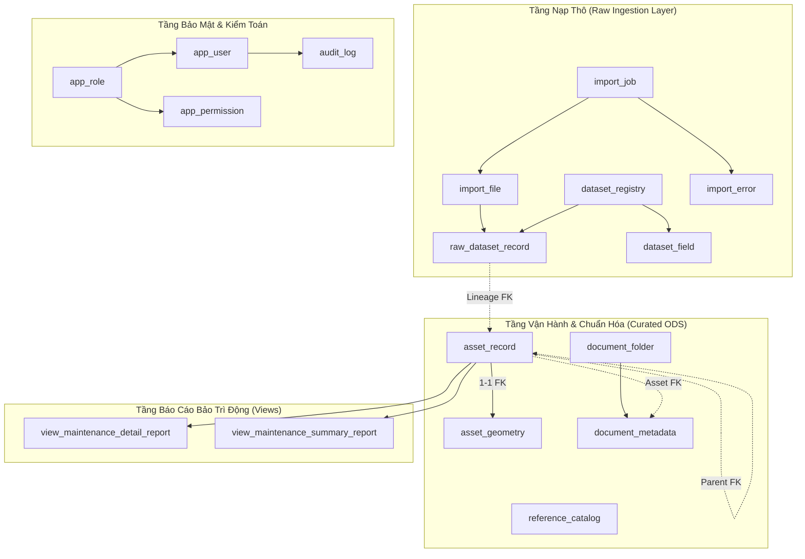

# TÀI LIỆU BÀN GIAO CƠ SỞ DỮ LIỆU CHO ỨNG DỤNG (DATABASE CODE HANDOFF)
**Dự án: Hệ thống Quản lý Kết cấu Hạ tầng Giao thông Đường bộ - Cục Đường bộ Việt Nam**
**Tài liệu tham chiếu kiến trúc kỹ thuật - Giai đoạn 2**

---

## 1. TỔNG QUAN HỆ THỐNG VÀ THÔNG SỐ KẾT NỐI

### 1.1. Hạ tầng Cơ sở Dữ liệu
Hệ thống Cơ sở Dữ liệu của nền tảng Quản lý Kết cấu Hạ tầng Giao thông Đường bộ (KCHT ĐB) được xây dựng trên:
- **Hệ quản trị CSDL:** PostgreSQL 16 kết hợp tiện ích mở rộng không gian **PostGIS 3.4+** (`postgis`) và tìm kiếm mờ chuỗi ký tự **pg_trgm** (`pg_trgm`).
- **Mã hóa ký tự (Encoding):** `UTF-8`, sắp xếp chuỗi (Collation) `en_US.utf8`.
- **Múi giờ lưu trữ:** Chuẩn `UTC` (các trường thời gian sử dụng kiểu `TIMESTAMP WITH TIME ZONE`).
- **Quản lý Migration:** Flyway 10 quản lý toàn bộ DDL từ `V1` đến `V5` đặt tại thư mục `db/migration/`.

### 1.2. Thông số Kết nối Môi trường Phát triển (Local Dev)
| Thuộc tính | Giá trị cấu hình | Biến môi trường tương ứng | Ghi chú |
| :--- | :--- | :--- | :--- |
| **Host** | `localhost` (hoặc `postgres` trong Docker Network) | `POSTGRES_HOST` | Chạy container `kcht_postgres` |
| **Port** | `5436` (Host) -> `5432` (Container) | `POSTGRES_PORT` | Tránh xung đột port 5432 hệ thống |
| **Database Name** | `kcht_db` | `POSTGRES_DB` | CSDL chính |
| **Username** | `kcht_user` | `POSTGRES_USER` | Toàn quyền Schema `public` |
| **Password** | `<configured outside source>` | `POSTGRES_PASSWORD` | Không lưu mật khẩu trong tài liệu |
| **JDBC URL** | `jdbc:postgresql://localhost:5436/kcht_db?currentSchema=public&reWriteBatchedInserts=true` | `SPRING_DATASOURCE_URL` | Bật tính năng tối ưu batch |

---

## 2. PHÂN BỔ BẢNG DỮ LIỆU THEO PHÂN LỚP KIẾN TRÚC

CSDL hiện tại bao gồm **14 bảng**, **2 view báo cáo động** và **1 bảng lịch sử migration Flyway**, được phân định thành 7 nhóm thực thể:



### 2.1. Nhóm Bảng Raw Ingestion (Nạp thô bất biến)
1. **`dataset_registry`:** Danh mục 658 tập dữ liệu crawl được từ hệ thống cũ. Đóng vai trò là Catalog định danh tập dữ liệu và metadata nguồn.
2. **`dataset_field`:** 10,142 trường dữ liệu chi tiết của 658 dataset, lưu định kiểu nguồn, cờ lọc (`is_filter`) và cờ tìm kiếm (`is_searchable`).
3. **`import_job`:** Quản lý vòng đời phiên chạy nạp dữ liệu (Trạng thái, thời gian chạy, số tệp hoàn tất, số bản ghi thành công/thất bại).
4. **`import_file`:** Quản lý chi tiết từng tệp JSON trong phiên nạp, kèm kích thước, SHA-256 xác thực và số bản ghi dự kiến từ `manifest.json`.
5. **`raw_dataset_record`:** Bảng chứa toàn bộ dữ liệu thô nguyên bản (1,102,397 bản ghi). Cột `raw_payload` lưu toàn bộ cấu trúc JSON gốc dưới dạng `JSONB`.
6. **`import_error`:** Lưu trữ lịch sử lỗi xử lý nếu có bản ghi hoặc tệp bị hỏng cấu trúc trong tiến trình nạp.

### 2.2. Nhóm Bảng Curated Operational (Chuẩn hóa vận hành)
1. **`asset_record`:** Bảng lõi hợp nhất toàn bộ 57 loại tài sản kết cấu hạ tầng giao thông đường bộ (Cầu, đường gom, cống rãnh, hộ lan, biển báo, gương cầu,...). Cung cấp các trường chuẩn hóa typed (tuyến, lý trình, địa bàn, đơn vị quản lý, trạng thái duyệt) và thuộc tính động đặc thù trong cột `attributes` JSONB.
2. **`asset_geometry`:** Bảng lưu trữ hình học không gian PostGIS tách biệt, liên kết 1-1 với `asset_record`. Hỗ trợ các cột không gian `geom`, `point_geom`, `line_geom` (SRID 4326) và 4 cột Bounding Box (`bbox_xmin`, `bbox_ymin`, `bbox_xmax`, `bbox_ymax`).

### 2.3. Nhóm Bảng Danh mục và Tài liệu (Reference & Documents)
1. **`reference_catalog`:** Bảng hợp nhất toàn bộ danh mục tham chiếu dùng chung (Cấp đường, loại biển báo, đơn vị quản lý, loại cầu,...).
2. **`document_folder`:** Cấu trúc phân cấp cây thư mục hồ sơ quản lý tài sản theo đơn vị và phân nhóm.
3. **`document_metadata`:** Siêu dữ liệu của tệp đính kèm (hồ sơ hoàn công, lý lịch cầu đường, biên bản kiểm tra, bản vẽ), liên kết tới tệp nhị phân trên MinIO/S3 hoặc thư mục cục bộ.

### 2.4. Nhóm Bảng Người dùng, Phân quyền & Kiểm toán (IAM & Audit)
1. **`app_role`:** Định nghĩa các vai trò hệ thống (`ROLE_ADMIN`, `ROLE_OPERATOR`, `ROLE_VIEWER`).
2. **`app_user`:** Tài khoản người dùng, mã hóa mật khẩu BCrypt, gắn với đơn vị và chi nhánh quản lý (`branch_id`).
3. **`app_permission`:** Phân quyền chi tiết dạng `<resource>:<action>` gắn theo từng vai trò.
4. **`audit_log`:** Nhật ký kiểm toán mọi thao tác thay đổi dữ liệu (CREATE, UPDATE, DELETE), lưu trữ `old_values` và `new_values` dạng JSONB.

### 2.5. Nhóm View Báo cáo Động (Dynamic Reporting Views)
1. **`view_maintenance_detail_report`:** Thay thế cho 148 bảng báo cáo chi tiết bảo trì dạng `maintenance_detail_*_chitiet`. View đọc trực tiếp từ `asset_record` lọc `is_deleted = false`.
2. **`view_maintenance_summary_report`:** Thay thế cho 148 bảng báo cáo tổng hợp `maintenance_detail_*_tonghop`. Tính toán động tổng số lượng công trình, tổng chiều dài km, tổng giá trị bảo trì theo từng loại tài sản và tuyến/chi nhánh.

---

## 3. BỘ ĐỊNH DANH VÀ QUY TẮC ÁNH XẠ DỮ LIỆU

### 3.1. Các Khóa Định danh Cốt lõi (Core Identifiers)
| Tên định danh | Kiểu dữ liệu | Phạm vi áp dụng | Quy ước định dạng | Quy tắc ánh xạ giữa các tầng |
| :--- | :--- | :--- | :--- | :--- |
| **`dataset_key`** / **`dataset_code`** | `VARCHAR(100)` | Toàn hệ thống | Chữ thường nối gạch dưới (VD: `tbl_bridge`, `mst_national_road`) | - Trong raw: `dataset_registry.dataset_key`, `raw_dataset_record.dataset_key`<br>- Trong curated: `asset_record.dataset_code`<br>- Tuyệt đối không thay đổi tên khóa này. |
| **`dataset_id`** | `BIGINT` | Tầng Raw Registry | Số nguyên tự tăng (`BIGSERIAL`) | Khóa chính của `dataset_registry.id`, dùng làm FK trong `dataset_field.dataset_id`. |
| **`record_key`** | `VARCHAR(150)` | Tầng Raw Ingestion | Chuỗi tự nhiên trích xuất từ JSON nguồn | Trích xuất theo thứ tự ưu tiên: `id` -> `gid` -> `vidagis_id` -> hash. Đảm bảo tính duy nhất trong cùng 1 `dataset_key`. |
| **`record_id`** | `VARCHAR(150)` | Tầng Curated Asset | Chuỗi nghiệp vụ tự nhiên (VD: `bridge_45228`) | Khóa nghiệp vụ duy nhất (`UNIQUE`) trong `asset_record`. Khớp 1-1 với `raw_dataset_record.record_key`. |
| **`asset_id`** | `BIGINT` | Tầng Curated & GIS | Số nguyên tự tăng (`BIGSERIAL`) | Khóa chính `asset_record.id`, được dùng làm Khóa ngoại 1-1 tại `asset_geometry.asset_id`. |
| **`import_job_id`** | `BIGINT` | Quản lý nạp liệu | Số nguyên tự tăng (`BIGSERIAL`) | Khóa chính `import_job.id`, dùng làm FK theo dõi trong `raw_dataset_record.import_job_id` và `import_file.job_id`. |
| **`file_entry_id`** | `VARCHAR(150)` | Tài liệu hồ sơ | Chuỗi hex UUID 32 ký tự | Khóa nghiệp vụ tự nhiên của tài liệu trích từ `documents.json` (VD: `cbfc95cca388487497048566b5d93252`). |

### 3.2. Quy tắc Ánh xạ từ Raw Payload sang Curated Asset
Dữ liệu thô từ `raw_dataset_record.raw_payload` được cấu trúc gồm hai phần:
1. **Phong bì thực thể ngoài (Envelope Properties):**
   - `id` -> `asset_record.record_id`
   - `gid` -> `asset_record.gid`
   - `fielddisplay` -> `asset_record.name`
   - `organization_id` -> `asset_record.organization_id` (mặc định `'moc_dbvn'`)
   - `branch_id` -> `asset_record.branch_id`
   - `branch_name` -> `asset_record.branch_name`
   - `state` -> `asset_record.state` (`'Approved'`, `'Pending'`, `'Drafting'`)
   - `state_name` -> `asset_record.state_name` (`'Đã duyệt'`, `'Chờ duyệt'`)
   - `parent_id` -> Làm sạch hậu tố `_<tên_bang>` để lấy ID thực thể cha
2. **Mảng thuộc tính động (`data_`):**
   Mảng JSON serialize chứa các phần tử `column_identify`. Lớp ứng dụng bóc tách các trường chính thành cột Typed:
   - `route_code` / `route_name` -> `asset_record.route_code`, `asset_record.route_name`
   - `km_from` / `km_to` -> Ép kiểu số `NUMERIC(10,3)` (loại bỏ thẻ HTML như `<b>`, `<font>`)
   - `lytrinh` -> Chuỗi hiển thị sạch `asset_record.lytrinh` (VD: `'Km 128 + 000'`)
   - `province_from_id` / `tinhthanhpho` -> `asset_record.province_id`, `asset_record.province_name`
   - `district_from_id` / `quanhuyen` -> `asset_record.district_name`
   - `town_from_id` / `xaphuong` -> `asset_record.town_name`
   - `capduong` / `road_class_id` -> `asset_record.road_class`
   - `roadtype` -> `asset_record.road_type`
   - `active_status` -> `asset_record.active_status`
   - `maintain_value` / `giatritaisan` -> `asset_record.maintain_value` (`NUMERIC(18,2)`)
   - `construction_year` / `namxaydung` -> `asset_record.construction_year` (`INTEGER`)
   - **Tất cả thuộc tính còn lại:** Đóng gói thành object JSON sạch `{ "key": "value" }` và lưu trữ trong cột `asset_record.attributes` (`JSONB`).

---

## 4. BẢNG TỔNG HỢP RÀNG BUỘC, CHỈ MỤC VÀ TRƯỜNG KIỂM TOÁN

### 4.1. Chi tiết Khóa chính (PK), Khóa ngoại (FK) và Unique Constraints
| Bảng | Primary Key | Foreign Keys | Unique Constraints | Check Constraints |
| :--- | :--- | :--- | :--- | :--- |
| **`app_role`** | `id` | Không | `role_code` | Không |
| **`app_user`** | `id` | `role_id -> app_role(id)` | `username`, `email` | Không |
| **`app_permission`** | `id` | `role_id -> app_role(id)` | `(role_id, permission_code)` | Không |
| **`audit_log`** | `id` | `user_id -> app_user(id)` | Không | Không |
| **`import_job`** | `id` | Không | Không | Không |
| **`import_file`** | `id` | `job_id -> import_job(id)` | `(job_id, file_path)` | Không |
| **`dataset_registry`** | `id` | Không | `dataset_key` | Không |
| **`dataset_field`** | `id` | `dataset_id -> dataset_registry(id)` | `(dataset_id, field_name)` | Không |
| **`raw_dataset_record`**| `id` | `dataset_key -> dataset_registry(dataset_key)`, `import_job_id -> import_job(id)` | `(dataset_key, record_key)` | Không |
| **`import_error`** | `id` | `job_id -> import_job(id)`, `file_id -> import_file(id)` | Không | Không |
| **`asset_record`** | `id` | `raw_record_id -> raw_dataset_record(id)` | `record_id` | `chk_asset_attributes_is_object` (`jsonb_typeof(attributes) = 'object'`) |
| **`asset_geometry`** | `id` | `asset_id -> asset_record(id)` (ON DELETE CASCADE) | `asset_id` (Quan hệ 1-1) | `chk_asset_geom_type` (`geom_type IN ('POINT', 'LINESTRING', 'POLYGON', ...)`) |
| **`reference_catalog`**| `id` | Không | `(catalog_code, item_code)` | Không |
| **`document_folder`** | `id` | `parent_folder_id -> document_folder(id)` | `folder_code` | Không |
| **`document_metadata`**| `id` | `folder_id -> document_folder(id)` | `file_entry_id` | Không |

### 4.2. Bảng Chỉ mục Hiệu năng (Indexes)
| Bảng | Tên Index | Loại Index | Cột được đánh chỉ mục | Điều kiện / Ghi chú |
| :--- | :--- | :--- | :--- | :--- |
| **`asset_record`** | `idx_asset_record_lookup` | B-Tree | `(dataset_code, is_deleted)` | Tối ưu phân trang theo loại tài sản |
| **`asset_record`** | `idx_asset_record_route_km` | B-Tree Partial | `(route_code, km_from, km_to)` | `WHERE is_deleted = FALSE` (LRS lookup) |
| **`asset_record`** | `idx_asset_record_scope` | B-Tree Partial | `(branch_id, province_id)` | `WHERE is_deleted = FALSE` (Phân quyền đơn vị) |
| **`asset_record`** | `idx_asset_record_attrs_gin` | GIN | `attributes jsonb_path_ops` | Tìm kiếm thuộc tính động JSONB |
| **`asset_record`** | `idx_asset_record_name_trgm` | GIN Trigram | `name gin_trgm_ops` | Tìm kiếm chuỗi tiếng Việt không dấu/có dấu |
| **`asset_geometry`** | `idx_asset_geom_gist` | GiST Không gian | `geom` | Bắt buộc cho truy vấn WebGIS BBOX/Intersect |
| **`asset_geometry`** | `idx_asset_geom_point_gist`| GiST Không gian | `point_geom` | `WHERE point_geom IS NOT NULL` |
| **`asset_geometry`** | `idx_asset_geom_line_gist` | GiST Không gian | `line_geom` | `WHERE line_geom IS NOT NULL` |
| **`asset_geometry`** | `idx_asset_geom_bbox` | B-Tree | `(bbox_xmin, bbox_ymin, bbox_xmax, bbox_ymax)` | Lọc nhanh khung nhìn Viewport |
| **`raw_dataset_record`**| `idx_raw_payload_gin` | GIN | `raw_payload jsonb_path_ops` | Truy vấn nội dung JSON thô |
| **`raw_dataset_record`**| `idx_raw_dataset_status` | B-Tree | `(dataset_key, record_status)` | Kiểm soát tiến trình chuyển đổi |

### 4.3. Cơ chế Xóa mềm, Quản lý Phiên bản và Kiểm toán
1. **Xóa mềm (Soft Delete):**
   - Áp dụng trên: `asset_record`, `reference_catalog`, `document_folder`, `document_metadata`.
   - Các trường điều khiển: `is_deleted` (BOOLEAN DEFAULT FALSE), `deleted_at` (TIMESTAMPTZ), `deleted_by` (VARCHAR(100)).
   - **Mọi truy vấn người dùng bình thường BẮT BUỘC có điều kiện `is_deleted = FALSE`.**
2. **Khóa Lạc quan (Optimistic Locking):**
   - Áp dụng trên: `asset_record`, `reference_catalog`.
   - Trường điều khiển: `version INTEGER NOT NULL DEFAULT 1`.
   - Được ánh xạ qua JPA `@Version` để ngăn ngừa xung đột ghi đè dữ liệu khi nhiều cán bộ cùng chỉnh sửa một tài sản.
3. **Kiểm toán Thao tác (Auditing):**
   - Mỗi thao tác CRUD (Tạo mới, Cập nhật thông số, Phê duyệt trạng thái, Xóa mềm) BẮT BUỘC ghi 1 bản ghi vào bảng `audit_log`.
   - Lưu trữ `old_values` (JSONB) và `new_values` (JSONB) để đối soát thay đổi lịch sử.

---

## 5. QUY TẮC HÌNH HỌC KHÔNG GIAN POSTGIS VÀ GEOJSON

### 5.1. Hệ Quy chiếu Không gian (CRS / SRID)
- **Chuẩn quy định duy nhất:** **WGS 84 (EPSG:4326)**.
- Đơn vị đo: Độ thập phân (Decimal Degrees).
- Kiểm tra tính hợp lệ trong lãnh thổ Việt Nam:
  $$\begin{cases} 102.0^\circ \le \text{Kinh độ (Longitude X)} \le 110.0^\circ \\ 8.0^\circ \le \text{Vĩ độ (Latitude Y)} \le 24.0^\circ \end{cases}$$
- Các tọa độ bằng 0 hoặc nằm ngoài biên giới Việt Nam được đánh dấu `is_valid = FALSE` và không trả về cho WebGIS để tránh làm lệch tỷ lệ phóng to (zoom extent) của bản đồ.

### 5.2. Định dạng GeoJSON và Quy ước Thứ tự Tọa độ
Theo tiêu chuẩn **RFC 7946 (GeoJSON)**:
- **Thứ tự tọa độ trong mảng bắt buộc:** `[Kinh độ (Longitude/X), Vĩ độ (Latitude/Y)]` (VD: `[106.758412, 21.942315]`).
- **Tuyệt đối không dùng thứ tự ngược `[lat, lon]`.**
- Cấu trúc trả về API chuẩn `FeatureCollection`:
```json
{
  "type": "FeatureCollection",
  "totalFeatures": 1,
  "features": [
    {
      "type": "Feature",
      "id": "bridge_45228",
      "geometry": {
        "type": "Point",
        "coordinates": [106.758412, 21.942315]
      },
      "properties": {
        "assetId": 45228,
        "recordId": "bridge_45228",
        "name": "Cầu Kỳ Cùng",
        "datasetCode": "tbl_bridge",
        "assetType": "BRIDGE",
        "routeCode": "QL.1",
        "lytrinh": "Km 128 + 000",
        "provinceName": "Tỉnh Lạng Sơn",
        "branchId": "kqldb_1",
        "state": "Approved"
      }
    }
  ]
}
```

---

## 6. RANH GIỚI MODULE VÀ PHÂN QUYỀN TRUY CẬP DỮ LIỆU

### 6.1. Ma trận Phân quyền Nguồn đọc/ghi theo Module Ứng dụng
| Module Ứng dụng | Bảng được phép ĐỌC | Bảng được phép GHI / CẬP NHẬT | Bảng TUYỆT ĐỐI CẤM TRUY CẬP |
| :--- | :--- | :--- | :--- |
| **Asset Module** | `asset_record`, `asset_geometry`, `reference_catalog`, `document_metadata` | `asset_record` (Soft delete, Update version, Audit), `asset_geometry` | `raw_dataset_record`, `import_job`, `app_user` |
| **GIS / Map Module** | `asset_geometry`, `asset_record` | Không (Chế độ Read-only) | `raw_dataset_record`, `document_metadata`, `app_user` |
| **Report Module** | `view_maintenance_detail_report`, `view_maintenance_summary_report`, `asset_record` | Không (Chế độ Read-only) | `raw_dataset_record`, `import_error` |
| **Document Module** | `document_folder`, `document_metadata` | `document_folder`, `document_metadata` | `raw_dataset_record`, `import_job` |
| **Reference Module** | `reference_catalog` | `reference_catalog` | `raw_dataset_record`, `asset_geometry` |
| **IAM & Audit Module**| `app_user`, `app_role`, `app_permission`, `audit_log` | `app_user`, `app_role`, `audit_log` | `asset_geometry`, `raw_dataset_record` |
| **Import Worker** | `dataset_registry`, `dataset_field`, `raw_dataset_record`, `import_job`, `import_file` | `import_job`, `import_file`, `raw_dataset_record`, `import_error` | Không ghi đè bảng nghiệp vụ ngoài phiên |

> [!CAUTION]
> **Quy tắc Bất biến đối với Bảng Raw:**
> - Frontend và các API nghiệp vụ của người dùng **TUYỆT ĐỐI KHÔNG** được truy vấn trực tiếp bảng `raw_dataset_record`.
> - Dữ liệu trong `raw_dataset_record` là **Bất biến (Immutable, Write-Once, Append-Only)**.
> - Bất kỳ thao tác CRUD nghiệp vụ nào (thêm mới, chỉnh sửa thông tin tài sản, cập nhật tọa độ, thay đổi trạng thái phê duyệt) chỉ được phép thực hiện trên tầng Curated (`asset_record`, `asset_geometry`) kèm theo tăng số phiên bản `version` và ghi nhật ký vào `audit_log`.

---

## 7. HỢP ĐỒNG API VÀ QUERY CONTRACT HIỆN HỮU

Hệ thống backend đã cung cấp sẵn các nhóm REST API chuẩn (tuân thủ OpenAPI 3.0 / Swagger):

### 7.1. Dataset & Asset API (`/api/datasets`)
- `GET /api/datasets?kind=asset&search=&page=0&size=20`: Danh sách các tập dữ liệu, phân trang và tìm kiếm.
- `GET /api/datasets/{datasetKey}/metadata`: Siêu dữ liệu, từ điển trường dữ liệu (`fields`) và kiểu hình học (`geometryType`).
- `GET /api/datasets/{datasetKey}/records?page=0&size=20&sort=id,asc&filter_{field}={val}`: Tra cứu danh sách bản ghi có bộ lọc an toàn và sắp xếp cho phép.
- `GET /api/datasets/{datasetKey}/records/{id}`: Chi tiết một bản ghi theo khóa định danh.
- `GET /api/datasets/{datasetKey}/geo?bbox=minX,minY,maxX,maxY&limit=500`: Dữ liệu không gian GeoJSON theo khung nhìn Bounding Box.

### 7.2. Reference Catalog API (`/api/catalogs`)
- `GET /api/catalogs/{catalogCode}?keyword=&page=0&size=50`: Tra cứu danh mục dùng chung kèm phân trang.
- `GET /api/catalogs/{catalogCode}/{itemCode}`: Chi tiết một phần tử danh mục theo mã.

### 7.3. Document Management API (`/api/documents`)
- `GET /api/documents/folders`: Cây thư mục hồ sơ tài liệu dạng phân cấp.
- `GET /api/documents/search?keyword=&folderId=&extension=&page=0&size=20`: Tra cứu hồ sơ tài liệu.
- `GET /api/documents/{fileEntryId}/metadata`: Thông tin chi tiết của tài liệu.
- `GET /api/documents/{fileEntryId}/file`: Tải tệp nhị phân đính kèm.

---

## 8. GIẢI TRÌNH CHÊNH LỆCH THỰC TẾ VÀ KIẾN TRÚC QUERY ADAPTER

### 8.1. Bảng Đối soát Tình trạng Dữ liệu Thực tế
| Bảng CSDL | Trạng thái trong DB | Số lượng bản ghi hiện hữu | Nguyên nhân & Bản chất kỹ thuật |
| :--- | :--- | :--- | :--- |
| **`raw_dataset_record`** | Đã nạp đầy đủ | **1,102,397 bản ghi** | Toàn bộ dữ liệu từ 658 tệp JSON đã được nạp thô thành công trong phiên Job 11 (Prompt 7). |
| **`dataset_registry`** | Đã nạp đầy đủ | **658 bản ghi** | Đăng ký 658 catalog tập dữ liệu. |
| **`dataset_field`** | Đã nạp đầy đủ | **10,142 bản ghi** | Từ điển trường dữ liệu của toàn bộ 658 dataset. |
| **`asset_record`** | Trống (0 dòng) | **0 bản ghi** | Tiến trình ETL từ Raw sang Curated chưa được kích hoạt trong prompt database trước đó. |
| **`asset_geometry`** | Trống (0 dòng) | **0 bản ghi** | Chờ kích hoạt song song cùng `asset_record`. |
| **`reference_catalog`**| Trống (0 dòng) | **0 bản ghi** | Chờ kích hoạt chuyển đổi từ `modules/*.json`. |
| **`document_metadata`**| Trống (0 dòng) | **0 bản ghi** | Chờ kích hoạt chuyển đổi từ `modules/documents*.json`. |
| **`app_user`** / **`role`**| Trống (0 dòng) | **0 bản ghi** | Cần khởi tạo tài khoản ban đầu (Admin Seed). |

### 8.2. Giải pháp Kiến trúc Query Adapter 2 Lớp (Dual-Layer Query Adapter)
Để đảm bảo các API hiện hữu tiếp tục hoạt động trơn tru đối với 1.1 triệu bản ghi đã nạp, đồng thời tuân thủ nghiêm ngặt quy tắc kiến trúc không cho phép mã nguồn mới truy cập bảng thô:
1. **Lớp Ứng dụng triển khai đầy đủ Typed JPA Entities & Repositories** cho toàn bộ các bảng Curated:
   - `AssetRecordEntity`, `AssetGeometryEntity`
   - `ReferenceCatalogEntity`
   - `DocumentFolderEntity`, `DocumentMetadataEntity`
   - `AppUserEntity`, `AppRoleEntity`, `AppPermissionEntity`, `AuditLogEntity`
2. **Cơ chế Truy vấn Cầu nối (Dual-Layer Query Bridge Adapter):**
   - Khi truy vấn đọc dữ liệu: Query Adapter kiểm tra bảng chuẩn `asset_record` trước. Nếu tập dữ liệu đã có bản ghi trong `asset_record`, Adapter thực hiện truy vấn trực tiếp trên `asset_record` và `asset_geometry`.
   - Nếu tập dữ liệu chưa có dữ liệu trong `asset_record` (đang trong giai đoạn chờ nạp chuyển đổi), Query Adapter sẽ kết nối qua Service tầng Raw để phục vụ dữ liệu cho Controller mà **không để Controller hay Frontend trực tiếp phụ thuộc vào bảng thô**.
3. **Cơ chế Ghi dữ liệu (Cập nhật / Thêm mới / Xóa mềm):**
   - **Bắt buộc 100% thực hiện trên `asset_record` và `asset_geometry`**.
   - Tuyệt đối không bao giờ cập nhật vào `raw_dataset_record`.
   - Mọi thay đổi dữ liệu đều kích hoạt ghi `audit_log` và tăng `version` lạc quan.
