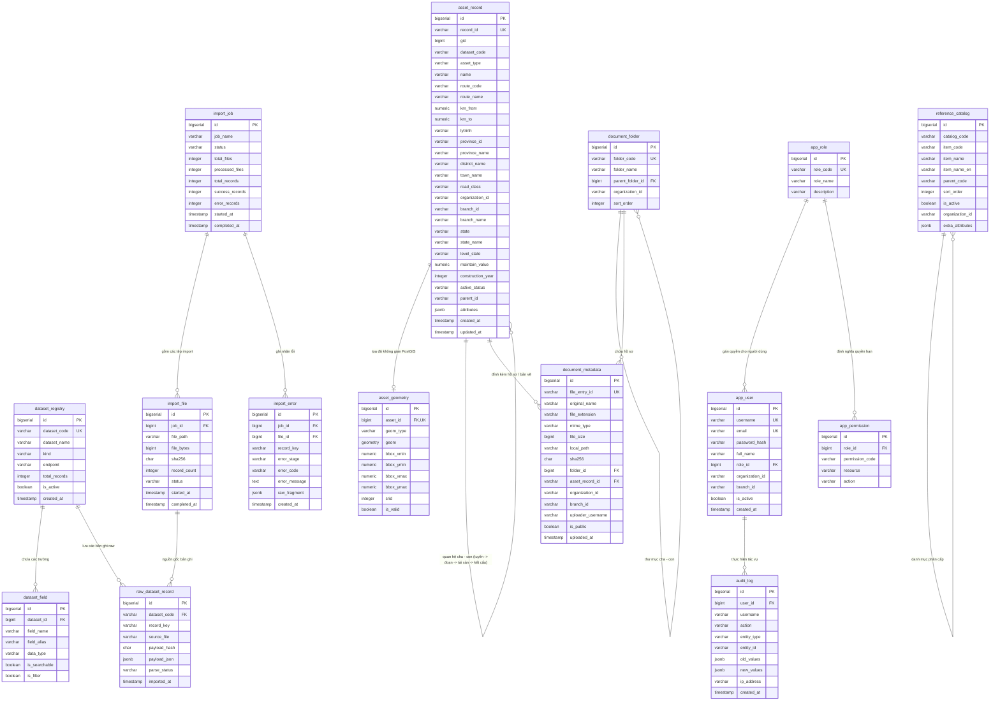

# MÔ HÌNH DỮ LIỆU CHI TIẾT (DATA MODEL SPECIFICATION)
**Hệ thống Quản lý Kết cấu Hạ tầng Giao thông Đường bộ - Cục Đường bộ Việt Nam**

---

## 1. Sơ đồ Quan hệ Thực thể (Mermaid Entity-Relationship Diagram)



---

## 2. Đặc tả Chi tiết các Bảng Dữ liệu (Table DDL Specification)

### 2.1 Nhóm Bảng Raw Ingestion & Registry

#### Bảng `dataset_registry`
Lưu trữ danh sách đăng ký toàn bộ 658 dataset, endpoint nguồn và trạng thái quản lý.
```sql
CREATE TABLE dataset_registry (
    id BIGSERIAL PRIMARY KEY,
    dataset_code VARCHAR(100) NOT NULL UNIQUE,       -- Ví dụ: tbl_road_sign, reference_moc_dbvn_c_c_capduong
    dataset_name VARCHAR(255) NOT NULL,              -- Tên tiếng Việt hiển thị
    kind VARCHAR(50) NOT NULL,                       -- 'asset', 'reference', 'document', 'report', 'statistic', 'auxiliary'
    endpoint VARCHAR(255),                           -- Endpoint nguồn crawl (VD: /asset/get-asset-is-same-tableid)
    source_file VARCHAR(255) NOT NULL,               -- Tên file json tương ứng
    total_records INTEGER DEFAULT 0,                 -- Số lượng bản ghi ghi nhận trong manifest
    is_active BOOLEAN DEFAULT TRUE,
    notes TEXT,
    created_at TIMESTAMP WITH TIME ZONE DEFAULT CURRENT_TIMESTAMP,
    updated_at TIMESTAMP WITH TIME ZONE DEFAULT CURRENT_TIMESTAMP
);

CREATE INDEX idx_dataset_registry_kind ON dataset_registry(kind);
```

#### Bảng `dataset_field`
Từ điển trường cho từng dataset (được nạp từ `field_dictionary.json` với 10,142 bản ghi).
```sql
CREATE TABLE dataset_field (
    id BIGSERIAL PRIMARY KEY,
    dataset_id BIGINT NOT NULL REFERENCES dataset_registry(id) ON DELETE CASCADE,
    field_name VARCHAR(150) NOT NULL,               -- Tên trường trong nguồn (VD: gid, field.ten, field.km_from)
    field_alias VARCHAR(255),                        -- Tên diễn giải tiếng Việt (VD: Lý trình điểm đầu)
    data_type VARCHAR(50) DEFAULT 'varchar',         -- Kiểu dữ liệu suy luận (varchar, numeric, jsonb, timestamp)
    is_searchable BOOLEAN DEFAULT FALSE,
    is_filter BOOLEAN DEFAULT FALSE,
    created_at TIMESTAMP WITH TIME ZONE DEFAULT CURRENT_TIMESTAMP,
    CONSTRAINT uq_dataset_field UNIQUE (dataset_id, field_name)
);

CREATE INDEX idx_dataset_field_lookup ON dataset_field(dataset_id, field_name);
```

#### Bảng `raw_dataset_record`
Hồ chứa dữ liệu thô nạp từ file JSON, giữ nguyên 100% cấu trúc gốc phục vụ kiểm tra đối chiếu và chạy lại ETL.
```sql
CREATE TABLE raw_dataset_record (
    id BIGSERIAL PRIMARY KEY,
    dataset_code VARCHAR(100) NOT NULL,              -- Mã tập dữ liệu
    record_key VARCHAR(150) NOT NULL,                -- Khóa nhận diện bản ghi trong JSON (thường là id hoặc gid)
    source_file VARCHAR(255) NOT NULL,               -- Đường dẫn tương đối của file nguồn
    payload_hash CHAR(64) NOT NULL,                  -- SHA-256 hash của chuỗi json payload
    payload_json JSONB NOT NULL,                     -- Toàn bộ nội dung bản ghi dạng JSONB
    import_job_id BIGINT,                            -- Tham chiếu tới phiên import
    parse_status VARCHAR(50) DEFAULT 'PENDING',      -- 'PENDING', 'PROCESSED', 'FAILED', 'SKIPPED'
    imported_at TIMESTAMP WITH TIME ZONE DEFAULT CURRENT_TIMESTAMP,
    CONSTRAINT uq_raw_dataset_record UNIQUE (dataset_code, record_key)
);

CREATE INDEX idx_raw_dataset_lookup ON raw_dataset_record(dataset_code, parse_status);
CREATE INDEX idx_raw_dataset_hash ON raw_dataset_record(payload_hash);
CREATE INDEX idx_raw_payload_gin ON raw_dataset_record USING GIN (payload_json jsonb_path_ops);
```

---

### 2.2 Nhóm Bảng Hạ tầng Vận hành Tài sản (Curated Assets)

#### Bảng `asset_record`
Bảng trung tâm của toàn bộ hệ thống hạ tầng đường bộ, hợp nhất 57 tập dữ liệu tài sản vào một mô hình chuẩn hóa.
```sql
CREATE TABLE asset_record (
    id BIGSERIAL PRIMARY KEY,
    record_id VARCHAR(150) NOT NULL UNIQUE,          -- Khóa kinh doanh duy nhất (trường `id` gốc, ví dụ: 'bridge_45228')
    gid BIGINT,                                      -- Khóa định danh số nguyên gốc trong hệ thống nguồn
    dataset_code VARCHAR(100) NOT NULL,              -- Mã bảng tài sản nguồn (VD: 'tbl_bridge', 'tbl_road_sign')
    asset_type VARCHAR(100) NOT NULL,                -- Phân nhóm tài sản chuẩn (VD: 'BRIDGE', 'ROAD_SIGN', 'GUARDRAIL')
    name VARCHAR(500),                               -- Tên tài sản (trích xuất từ fielddisplay hoặc field.ten)
    
    -- Thuộc tính tuyến và lý trình
    route_code VARCHAR(100),                         -- Mã tuyến quốc lộ / tỉnh lộ (VD: 'QL.1', 'QL.2')
    route_name VARCHAR(255),                         -- Tên tuyến
    km_from NUMERIC(10, 3),                          -- Lý trình điểm đầu (km dạng số, ví dụ 128.000)
    km_to NUMERIC(10, 3),                            -- Lý trình điểm cuối (km dạng số, ví dụ 139.771)
    lytrinh VARCHAR(100),                            -- Chuỗi hiển thị lý trình sạch (VD: 'Km 128 + 000')
    
    -- Thuộc tính hành chính & quản lý
    province_id VARCHAR(100),                        -- Mã hoặc tên chuẩn tỉnh thành điểm đầu/đặt tài sản
    province_name VARCHAR(150),                      -- Tên tỉnh thành phố
    district_name VARCHAR(150),                      -- Tên quận/huyện
    town_name VARCHAR(150),                          -- Tên xã/phường
    road_class VARCHAR(100),                         -- Cấp kỹ thuật đường (Cấp I, II, III, Cao tốc...)
    road_type VARCHAR(100),                          -- Loại đường (Quốc lộ, Tỉnh lộ, Đường gom...)
    
    -- Cơ quan và Đơn vị quản trị
    organization_id VARCHAR(100) DEFAULT 'moc_dbvn', -- Tổ chức chủ quản (VD: 'moc_dbvn')
    branch_id VARCHAR(100),                          -- Mã chi nhánh / Khu QLĐB / Sở GTVT (VD: 'kqldb_1', 'sxd_tq')
    branch_name VARCHAR(255),                        -- Tên hiển thị chi nhánh quản lý
    management_agency VARCHAR(255),                  -- Đơn vị trực tiếp quản lý/bảo trì
    
    -- Vòng đời và trạng thái
    state VARCHAR(50) DEFAULT 'Approved',            -- Trạng thái duyệt ('Approved', 'Pending', 'Drafting')
    state_name VARCHAR(100) DEFAULT 'Đã duyệt',      -- Tên trạng thái tiếng Việt
    level_state VARCHAR(50) DEFAULT 'cdb_vn',        -- Cấp phê duyệt
    active_status VARCHAR(100),                      -- Tình trạng khai thác (Đang khai thác, Đang sửa chữa...)
    maintain_value NUMERIC(18, 2),                   -- Giá trị bảo trì ghi nhận
    construction_year INTEGER,                       -- Năm xây dựng / đưa vào khai thác
    
    -- Quan hệ phân cấp tài sản
    parent_id VARCHAR(150),                          -- ID tài sản cha (VD: Đoạn tuyến cha hoặc Cầu cha)
    
    -- Toàn bộ thuộc tính nghiệp vụ chi tiết dạng JSONB
    attributes JSONB NOT NULL DEFAULT '{}'::jsonb,   -- Chứa toàn bộ các trường động đã unpack từ data_
    
    created_at TIMESTAMP WITH TIME ZONE DEFAULT CURRENT_TIMESTAMP,
    updated_at TIMESTAMP WITH TIME ZONE DEFAULT CURRENT_TIMESTAMP
);

-- Chỉ mục tối ưu hóa tìm kiếm, phân trang và thống kê
CREATE INDEX idx_asset_record_dataset ON asset_record(dataset_code);
CREATE INDEX idx_asset_record_asset_type ON asset_record(asset_type);
CREATE INDEX idx_asset_record_route_km ON asset_record(route_code, km_from, km_to);
CREATE INDEX idx_asset_record_branch ON asset_record(branch_id);
CREATE INDEX idx_asset_record_province ON asset_record(province_id);
CREATE INDEX idx_asset_record_parent ON asset_record(parent_id);
CREATE INDEX idx_asset_record_state ON asset_record(state);
CREATE INDEX idx_asset_record_attrs_gin ON asset_record USING GIN (attributes jsonb_path_ops);
CREATE INDEX idx_asset_record_name_trgm ON asset_record USING GIN (name gin_trgm_ops);
```

#### Bảng `asset_geometry`
Quản lý dữ liệu không gian PostGIS tách biệt, liên kết 1-1 với `asset_record`.
```sql
CREATE EXTENSION IF NOT EXISTS postgis;
CREATE EXTENSION IF NOT EXISTS pg_trgm;

CREATE TABLE asset_geometry (
    id BIGSERIAL PRIMARY KEY,
    asset_id BIGINT NOT NULL UNIQUE REFERENCES asset_record(id) ON DELETE CASCADE,
    geom_type VARCHAR(50) NOT NULL,                  -- 'POINT', 'LINESTRING', 'MULTILINESTRING', 'POLYGON'
    geom GEOMETRY(Geometry, 4326) NOT NULL,          -- Hình học tổng quát chuẩn WGS 84
    
    -- Tọa độ Bounding Box để hỗ trợ truy vấn khung nhìn siêu tốc
    bbox_xmin NUMERIC(12, 8),
    bbox_ymin NUMERIC(12, 8),
    bbox_xmax NUMERIC(12, 8),
    bbox_ymax NUMERIC(12, 8),
    
    srid INTEGER DEFAULT 4326,
    is_valid BOOLEAN DEFAULT TRUE,
    created_at TIMESTAMP WITH TIME ZONE DEFAULT CURRENT_TIMESTAMP
);

-- Chỉ mục không gian GiST bắt buộc cho bản đồ WebGIS
CREATE INDEX idx_asset_geom_gist ON asset_geometry USING GIST (geom);
CREATE INDEX idx_asset_geom_bbox ON asset_geometry(bbox_xmin, bbox_ymin, bbox_xmax, bbox_ymax);
```

---

### 2.3 Nhóm Bảng Danh mục Tham chiếu & Tài liệu Hồ sơ

#### Bảng `reference_catalog`
Lưu trữ hợp nhất 152 danh mục dùng chung (`reference_moc_*`) và danh mục biển báo (`road_sign_catalog`).
```sql
CREATE TABLE reference_catalog (
    id BIGSERIAL PRIMARY KEY,
    catalog_code VARCHAR(100) NOT NULL,              -- Mã danh mục (VD: 'capduong', 'road_sign_catalog')
    item_code VARCHAR(100) NOT NULL,                 -- Mã phần tử (VD: '03', 'W.247')
    item_name VARCHAR(255) NOT NULL,                 -- Tên phần tử hiển thị (VD: 'Cấp III', 'Chú ý xe đỗ')
    item_name_en VARCHAR(255),                       -- Tên tiếng Anh
    parent_code VARCHAR(100),                        -- Mã phần tử cha (nếu có phân cấp)
    sort_order INTEGER DEFAULT 0,                    -- Thứ tự sắp xếp (trọng số hiển thị)
    is_active BOOLEAN DEFAULT TRUE,
    organization_id VARCHAR(100) DEFAULT 'moc_dbvn',
    extra_attributes JSONB DEFAULT '{}'::jsonb,      -- Chứa kích thước biển báo, màu sắc, icon, v.v.
    created_at TIMESTAMP WITH TIME ZONE DEFAULT CURRENT_TIMESTAMP,
    CONSTRAINT uq_reference_catalog UNIQUE (catalog_code, item_code)
);

CREATE INDEX idx_ref_catalog_code ON reference_catalog(catalog_code, sort_order);
CREATE INDEX idx_ref_catalog_parent ON reference_catalog(catalog_code, parent_code);
```

#### Bảng `document_folder`
Quản lý cây thư mục hồ sơ hoàn công, văn bản quản lý (nạp từ `document_folders` và `documents_group_*`).
```sql
CREATE TABLE document_folder (
    id BIGSERIAL PRIMARY KEY,
    folder_code VARCHAR(100) NOT NULL UNIQUE,        -- Mã thư mục (VD: 'cdb_vn', 'group_10')
    folder_name VARCHAR(255) NOT NULL,               -- Tên thư mục (VD: 'Cục Đường bộ Việt Nam')
    parent_folder_id BIGINT REFERENCES document_folder(id) ON DELETE SET NULL,
    organization_id VARCHAR(100) DEFAULT 'moc_dbvn',
    sort_order INTEGER DEFAULT 0,
    created_at TIMESTAMP WITH TIME ZONE DEFAULT CURRENT_TIMESTAMP
);

CREATE INDEX idx_doc_folder_parent ON document_folder(parent_folder_id);
```

#### Bảng `document_metadata`
Chỉ mục thông tin tệp tài liệu, liên kết chặt chẽ tới thư mục và tài sản cụ thể.
```sql
CREATE TABLE document_metadata (
    id BIGSERIAL PRIMARY KEY,
    file_entry_id VARCHAR(150) NOT NULL UNIQUE,      -- ID tệp nguồn (VD: 'cbfc95cca388487497048566b5d93252')
    original_name VARCHAR(500) NOT NULL,             -- Tên tệp gốc kèm phần mở rộng
    file_extension VARCHAR(50),                      -- 'pdf', 'xlsx', 'docx', 'dwg', 'jpg'...
    mime_type VARCHAR(150),                          -- MIME type chuẩn
    file_size BIGINT,                                -- Dung lượng tệp (bytes)
    local_path VARCHAR(500),                         -- Đường dẫn lưu trữ (VD: 'document_files/72a0de08921d7212cb794828.xlsx')
    sha256 CHAR(64),                                 -- Băm kiểm tra tính toàn vẹn
    
    -- Liên kết thư mục & phân quyền
    folder_id BIGINT REFERENCES document_folder(id) ON DELETE SET NULL,
    organization_id VARCHAR(100) DEFAULT 'moc_dbvn',
    branch_id VARCHAR(100),
    
    -- Liên kết tài sản (Foreign key logic tới asset_record)
    asset_record_id VARCHAR(150),                    -- Tham chiếu tới asset_record.record_id
    
    uploader_user_id VARCHAR(100),
    uploader_username VARCHAR(150),
    is_public BOOLEAN DEFAULT FALSE,
    uploaded_at TIMESTAMP WITH TIME ZONE,
    created_at TIMESTAMP WITH TIME ZONE DEFAULT CURRENT_TIMESTAMP
);

CREATE INDEX idx_doc_meta_folder ON document_metadata(folder_id);
CREATE INDEX idx_doc_meta_asset ON document_metadata(asset_record_id);
CREATE INDEX idx_doc_meta_sha256 ON document_metadata(sha256);
```

---

### 2.4 Nhóm Bảng Bảo mật, Phân quyền & Giám sát Hệ thống

#### Bảng `app_role`
```sql
CREATE TABLE app_role (
    id BIGSERIAL PRIMARY KEY,
    role_code VARCHAR(50) NOT NULL UNIQUE,           -- 'ROLE_ADMIN', 'ROLE_OPERATOR', 'ROLE_VIEWER'
    role_name VARCHAR(150) NOT NULL,
    description VARCHAR(255),
    created_at TIMESTAMP WITH TIME ZONE DEFAULT CURRENT_TIMESTAMP
);
```

#### Bảng `app_user`
```sql
CREATE TABLE app_user (
    id BIGSERIAL PRIMARY KEY,
    username VARCHAR(100) NOT NULL UNIQUE,
    email VARCHAR(150) NOT NULL UNIQUE,
    password_hash VARCHAR(255) NOT NULL,
    full_name VARCHAR(255) NOT NULL,
    role_id BIGINT NOT NULL REFERENCES app_role(id),
    organization_id VARCHAR(100) DEFAULT 'moc_dbvn',
    branch_id VARCHAR(100),                          -- Khóa chặt người dùng vào chi nhánh (VD: 'kqldb_1')
    is_active BOOLEAN DEFAULT TRUE,
    created_at TIMESTAMP WITH TIME ZONE DEFAULT CURRENT_TIMESTAMP,
    updated_at TIMESTAMP WITH TIME ZONE DEFAULT CURRENT_TIMESTAMP
);

CREATE INDEX idx_app_user_branch ON app_user(branch_id);
```

#### Bảng `app_permission`
```sql
CREATE TABLE app_permission (
    id BIGSERIAL PRIMARY KEY,
    role_id BIGINT NOT NULL REFERENCES app_role(id) ON DELETE CASCADE,
    permission_code VARCHAR(100) NOT NULL,           -- 'ASSET:READ', 'ASSET:WRITE', 'DOCUMENT:DOWNLOAD'
    resource VARCHAR(100) NOT NULL,
    action VARCHAR(50) NOT NULL,
    CONSTRAINT uq_app_permission UNIQUE (role_id, permission_code)
);
```

#### Bảng `audit_log`
Nhật ký kiểm toán mọi tác động vào hệ thống phục vụ an toàn thông tin cơ quan nhà nước.
```sql
CREATE TABLE audit_log (
    id BIGSERIAL PRIMARY KEY,
    user_id BIGINT REFERENCES app_user(id) ON DELETE SET NULL,
    username VARCHAR(100),
    action VARCHAR(100) NOT NULL,                    -- 'CREATE', 'UPDATE', 'DELETE', 'EXPORT_REPORT'
    entity_type VARCHAR(100) NOT NULL,               -- 'ASSET', 'DOCUMENT', 'USER'
    entity_id VARCHAR(150) NOT NULL,
    old_values JSONB,
    new_values JSONB,
    ip_address VARCHAR(45),
    user_agent TEXT,
    created_at TIMESTAMP WITH TIME ZONE DEFAULT CURRENT_TIMESTAMP
);

CREATE INDEX idx_audit_log_user ON audit_log(user_id);
CREATE INDEX idx_audit_log_entity ON audit_log(entity_type, entity_id);
CREATE INDEX idx_audit_log_created ON audit_log(created_at);
```

---

### 2.5 Nhóm Bảng Kiểm soát Tiến trình Nạp Dữ liệu (Import Tracking)

#### Bảng `import_job`
```sql
CREATE TABLE import_job (
    id BIGSERIAL PRIMARY KEY,
    job_name VARCHAR(150) NOT NULL,
    status VARCHAR(50) NOT NULL DEFAULT 'RUNNING',   -- 'RUNNING', 'COMPLETED', 'FAILED', 'CANCELLED'
    total_files INTEGER DEFAULT 0,
    processed_files INTEGER DEFAULT 0,
    total_records INTEGER DEFAULT 0,
    success_records INTEGER DEFAULT 0,
    error_records INTEGER DEFAULT 0,
    started_at TIMESTAMP WITH TIME ZONE DEFAULT CURRENT_TIMESTAMP,
    completed_at TIMESTAMP WITH TIME ZONE
);
```

#### Bảng `import_file`
```sql
CREATE TABLE import_file (
    id BIGSERIAL PRIMARY KEY,
    job_id BIGINT NOT NULL REFERENCES import_job(id) ON DELETE CASCADE,
    file_path VARCHAR(255) NOT NULL,
    file_bytes BIGINT NOT NULL,
    sha256 CHAR(64) NOT NULL,
    record_count INTEGER DEFAULT 0,
    status VARCHAR(50) NOT NULL DEFAULT 'PENDING',   -- 'PENDING', 'PROCESSING', 'COMPLETED', 'FAILED'
    started_at TIMESTAMP WITH TIME ZONE,
    completed_at TIMESTAMP WITH TIME ZONE
);

CREATE INDEX idx_import_file_job ON import_file(job_id);
```

#### Bảng `import_error`
```sql
CREATE TABLE import_error (
    id BIGSERIAL PRIMARY KEY,
    job_id BIGINT NOT NULL REFERENCES import_job(id) ON DELETE CASCADE,
    file_id BIGINT REFERENCES import_file(id) ON DELETE CASCADE,
    record_key VARCHAR(150),
    error_stage VARCHAR(50) NOT NULL,                -- 'RAW_INGEST', 'JSON_PARSE', 'CURATION', 'GEOMETRY_CONVERT'
    error_code VARCHAR(100),
    error_message TEXT NOT NULL,
    raw_fragment JSONB,
    created_at TIMESTAMP WITH TIME ZONE DEFAULT CURRENT_TIMESTAMP
);

CREATE INDEX idx_import_error_job ON import_error(job_id);
```

---

## 3. Lý do Phân định Cột Typed vs Cột JSONB

| Tên trường | Kiểu lưu trữ | Lý do kỹ thuật & Nghiệp vụ |
| :--- | :--- | :--- |
| `record_id`, `gid` | **Typed (VARCHAR, BIGINT)** | Định danh duy nhất, làm khóa chính nghiệp vụ và liên kết quan hệ nước ngoài (Foreign Key). |
| `dataset_code`, `asset_type` | **Typed (VARCHAR)** | Phân vùng tài sản, lọc danh mục trong giao diện người dùng và định tuyến controller trong Spring Boot. |
| `route_code`, `km_from`, `km_to` | **Typed (VARCHAR, NUMERIC)** | Điều kiện lọc phạm vi lý trình (`BETWEEN :from AND :to`). Ép kiểu số cho phép toán tử so sánh số học và đánh chỉ mục B-Tree Composite siêu tốc. |
| `province_id`, `branch_id` | **Typed (VARCHAR)** | Phân quyền bảo mật theo phạm vi dữ liệu (Data Scope Filtering). Người dùng ở Khu QLĐB 1 chỉ thấy bản ghi của `branch_id = 'kqldb_1'`. |
| `geom` | **Typed (PostGIS Geometry)** | Phục vụ trực quan hóa bản đồ, truy vấn khung nhìn (`ST_Intersects`), tính bán kính tìm kiếm lân cận. Không thể dùng JSONB thuần. |
| `attributes` | **JSONB** | Chứa 531 thuộc tính đặc thù khác nhau giữa 57 loại công trình. Lưu dạng JSONB giúp không phải thêm hàng trăm cột thưa (sparse columns) gây lãng phí bộ nhớ và khóa DDL khi nguồn dữ liệu có thêm chỉ tiêu mới. |

---

## 4. Chiến lược Đánh Chỉ mục (Indexing Strategy)

1. **B-Tree Indexes:**
   - Đặt trên tất cả các khóa ngoại, khóa logic, trạng thái và ngày tạo.
   - Composite Index `(route_code, km_from, km_to)` trên `asset_record`: Tối ưu hóa truy vấn tìm kiếm các công trình trên một đoạn tuyến cụ thể.
2. **GiST (Generalized Search Tree) Index:**
   - Bắt buộc trên `asset_geometry(geom)`: Giảm độ phức tạp thuật toán tìm kiếm không gian từ $O(N)$ xuống $O(\log N)$ với R-Tree.
3. **GIN (Generalized Inverted Index) Indexes:**
   - `attributes jsonb_path_ops` trên `asset_record`: Tối ưu hóa các toán tử kiểm tra sự tồn tại hoặc chứa cặp key-value JSON (`@>`).
   - `name gin_trgm_ops` trên `asset_record`: Cho phép tìm kiếm mờ (fuzzy search, autocomplete tên tài sản) theo tiếng Việt không dấu hoặc có dấu.
