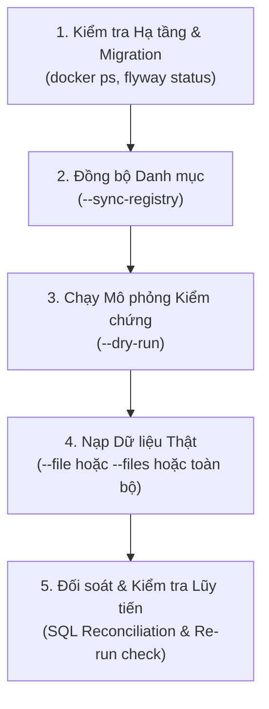

# HƯỚNG DẪN VẬN HÀNH TIẾN TRÌNH NHẬP DỮ LIỆU
*(IMPORT_RUNBOOK.md)*

**Dự án:** Cơ sở dữ liệu Quản lý Kết cấu Hạ tầng Giao thông Đường bộ (KCHT)  
**Phạm vi:** Dành cho kỹ sư dữ liệu, DevOps và kỹ sư backend vận hành hệ thống nhập liệu  
**Phiên bản:** 1.0 (2026-10-05)  

---

## 1. YÊU CẦU TIỀN ĐIỀU KIỆN (PREREQUISITES)

Trước khi kích hoạt bất kỳ lệnh nạp dữ liệu nào, hệ thống phải đáp ứng các tiêu chuẩn sau:

1. **Thư mục dữ liệu nguồn:**
   - Đường dẫn: `C:\Data\kcht_json_2026-10-05` (hoặc biến môi trường `KCHT_DATA_DIR`).
   - Kiểm tra bắt buộc có file `manifest.json` và `field_dictionary.json`.
   - Quyền hạn: Read-only (tiến trình tuyệt đối không sửa đổi file JSON nguồn).
2. **Cơ sở dữ liệu PostgreSQL + PostGIS:**
   - PostgreSQL 16 trở lên, PostGIS 3.4.
   - Container `kcht_postgres` đang chạy ở trạng thái `healthy`.
   - Kết nối: `localhost:5436`, CSDL: `kcht_db`, user: `kcht_user`.
3. **Môi trường ứng dụng:**
   - Java 21 (JDK 21 LTS 64-bit).
   - Đã đóng gói file JAR: `target/kcht-import-service-1.0.0-SNAPSHOT.jar`.

---

## 2. QUY TRÌNH THỰC HIỆN 5 BƯỚC CHUẨN (STANDARD 5-STEP PROCEDURE)



---

### BƯỚC 1: KIỂM TRA HẠ TẦNG VÀ DI TRÚ DỮ LIỆU

Khởi động container CSDL (nếu chưa chạy):
```bash
docker compose up -d
```

Kiểm tra trạng thái container và PostGIS:
```bash
# 1. Kiểm tra container healthy
docker ps --filter "name=kcht_postgres"

# 2. Kiểm tra phiên bản PostGIS
docker exec -i kcht_postgres psql -U kcht_user -d kcht_db -c "SELECT PostGIS_Full_Version();"

# 3. Kiểm tra trạng thái Flyway migrations
docker exec -i kcht_postgres psql -U kcht_user -d kcht_db -c "SELECT installed_rank, version, description, success FROM flyway_schema_history;"
```
*Điều kiện qua:* Tất cả migration V1 -> V5 phải có `success = true`.

---

### BƯỚC 2: ĐỒNG BỘ SIÊU DỮ LIỆU (DATASET REGISTRY & DICTIONARY)

Trước khi nạp dữ liệu thô, nạp toàn bộ danh mục 658 datasets và 10.142 trường để đảm bảo toàn vẹn khóa ngoại (`FOREIGN KEY`):

```bash
java -Dfile.encoding=UTF-8 -jar target/kcht-import-service-1.0.0-SNAPSHOT.jar --sync-registry
```

Đối soát sau khi đồng bộ:
```bash
docker exec -i kcht_postgres psql -U kcht_user -d kcht_db -c "
SELECT count(*) AS total_datasets FROM dataset_registry;
SELECT count(*) AS total_fields FROM dataset_field;
"
```
*Chỉ số kỳ vọng:* `total_datasets = 658`, `total_fields = 10142`.

---

### BƯỚC 3: CHẠY MÔ PHỎNG KIỂM TRA (DRY-RUN)

Chế độ `--dry-run` duyệt luồng JSON, kiểm tra tính hợp lệ của schema, trích xuất khóa định danh và tính mã băm SHA-256 mà **không ghi bất kỳ dữ liệu nào vào CSDL**:

```bash
# Dry-run cho một tệp đơn
java -Dfile.encoding=UTF-8 -jar target/kcht-import-service-1.0.0-SNAPSHOT.jar \
  --dry-run --file=assets/duonggom.json

# Dry-run cho danh sách tệp xác định
java -Dfile.encoding=UTF-8 -jar target/kcht-import-service-1.0.0-SNAPSHOT.jar \
  --dry-run --files=assets/mst_national_road.json,assets/tbl_bridge.json

# Dry-run có giới hạn số lượng bản ghi
java -Dfile.encoding=UTF-8 -jar target/kcht-import-service-1.0.0-SNAPSHOT.jar \
  --dry-run --file=assets/tbl_road_sign.json --limit=1000
```

---

### BƯỚC 4: THỰC THI NẠP THỰC TẾ (PRODUCTION INGESTION)

Cấu hình tham số JVM khuyến nghị cho môi trường thực thi lớn:
- `-Xms512m -Xmx2048m`: cấp phát đủ bộ nhớ đệm cho batch và JDBC driver.
- `-Dfile.encoding=UTF-8`: bảo đảm không lỗi font tiếng Việt Unicode.
- `"-Dkcht.import.batch-size=500"`: kích thước lô tối ưu nhất.

#### Kịch bản 4.1: Nạp một tệp đơn lẻ
```bash
java -Xms512m -Xmx2048m -Dfile.encoding=UTF-8 "-Dkcht.import.batch-size=500" \
  -jar target/kcht-import-service-1.0.0-SNAPSHOT.jar \
  --file=assets/tbl_bridge.json
```

#### Kịch bản 4.2: Nạp nhóm tệp xác định (phân tách dấu phẩy)
```bash
java -Xms512m -Xmx2048m -Dfile.encoding=UTF-8 "-Dkcht.import.batch-size=500" \
  -jar target/kcht-import-service-1.0.0-SNAPSHOT.jar \
  --files=assets/mst_national_road.json,assets/tbl_bridge.json,assets/tbl_road_sign.json
```

#### Kịch bản 4.3: Nạp theo nhóm thư mục qua bộ lọc
```bash
# Nạp toàn bộ các tệp tài sản trong thư mục assets/
java -Xms512m -Xmx2048m -Dfile.encoding=UTF-8 "-Dkcht.import.batch-size=500" \
  -jar target/kcht-import-service-1.0.0-SNAPSHOT.jar \
  --filter=assets/

# Nạp toàn bộ các tệp mô-đun trong thư mục modules/
java -Xms512m -Xmx2048m -Dfile.encoding=UTF-8 "-Dkcht.import.batch-size=500" \
  -jar target/kcht-import-service-1.0.0-SNAPSHOT.jar \
  --filter=modules/
```

---

### BƯỚC 5: ĐỐI SOÁT VÀ KIỂM TRA LŨY TIẾN (RECONCILIATION)

Sau khi hoàn tất phiên nạp, chạy bộ câu lệnh SQL đối soát sau:

```sql
-- 1. Thống kê số lượng bản ghi và kiểm tra trùng lặp khóa theo từng dataset
SELECT 
    dataset_key, 
    count(*) AS total_records, 
    count(DISTINCT record_key) AS unique_keys,
    count(*) - count(DISTINCT payload_sha256) AS duplicate_payloads
FROM raw_dataset_record
GROUP BY dataset_key
ORDER BY total_records DESC;

-- 2. Kiểm tra nhật ký phiên nạp gần nhất
SELECT id, job_name, status, total_files, processed_files, total_records, success_records, error_records, started_at, completed_at
FROM import_job
ORDER BY id DESC LIMIT 5;

-- 3. Kiểm tra danh sách tệp bị lỗi (nếu có)
SELECT * FROM import_file WHERE status = 'FAILED';

-- 4. Kiểm tra chi tiết lỗi ghi nhận
SELECT * FROM import_error ORDER BY id DESC LIMIT 10;
```

---

## 3. XỬ LÝ SỰ CỐ VÀ KHÔI PHỤC (TROUBLESHOOTING & RECOVERY)

### Sự cố 1: Tiến trình bị dừng đột ngột (Killed / Out of Memory / Mất điện)
- **Bản chất kỹ thuật:** 
  - Giao dịch được commit theo từng lô (`batch-size: 500`). Các lô đã commit trước đó được lưu an toàn trong CSDL.
  - Tệp đang nạp dở dang có trạng thái `PROCESSING` trong bảng `import_file`.
- **Cách khôi phục:**
  - Chỉ cần chạy lại lệnh import tương tự.
  - Cơ chế **Idempotent Upsert** sẽ kiểm tra `(dataset_key, record_key)`. Những bản ghi đã ghi trước đó sẽ tự động được **bỏ qua (`skipped`)**, và hệ thống tiếp tục nạp phần còn thiếu của tệp mà **không tạo bất kỳ bản ghi trùng lặp nào**.

### Sự cố 2: Cơ sở dữ liệu bị ngắt kết nối hoặc khởi động lại
- **Bản chất kỹ thuật:**
  - HikariCP sẽ phát sinh `ConnectionException` và giao dịch lô hiện tại bị rollback sạch sẽ.
  - File dở dang được đánh dấu `FAILED` hoặc giữ nguyên ở checkpoint trước đó.
- **Cách khôi phục:**
  1. Kiểm tra container CSDL đã sống lại: `docker ps`.
  2. Kích hoạt lại lệnh import, hệ thống tự động tái kết nối qua connection pool và tiếp tục hoàn tất các tệp còn lại.

### Sự cố 3: Một bản ghi trong JSON bị hỏng cấu trúc (Corrupted JSON)
- **Bản chất kỹ thuật:**
  - Bộ thẩm định `PayloadValidator` phát hiện cấu trúc không phải JSON Object hoặc thiếu khóa bắt buộc.
  - Bản ghi lỗi được lưu vết chi tiết vào bảng `import_error` (`error_stage = 'VALIDATE'`).
  - **Tiến trình không bị dừng:** Các bản ghi hợp lệ khác trong cùng tệp và các tệp tiếp theo vẫn được nạp bình thường.
- **Cách kiểm tra:**
  ```sql
  SELECT dataset_key, record_key, error_code, error_message, raw_fragment 
  FROM import_error 
  WHERE created_at >= NOW() - INTERVAL '1 hour';
  ```

---

## 4. QUY TRÌNH ROLLBACK / XÓA DỮ LIỆU ĐỂ THỬ LẠI TỪ ĐẦU (CLEANUP)

Trong trường hợp cần dọn dẹp một dataset cụ thể để chạy lại từ trạng thái trống:

```sql
-- Xóa toàn bộ dữ liệu của một dataset xác định:
DELETE FROM raw_dataset_record WHERE dataset_key = 'tbl_road_sign';

-- Đặt lại trạng thái tiến trình tệp:
UPDATE import_file SET status = 'PENDING' WHERE file_path LIKE '%tbl_road_sign%';
```

Trong trường hợp cần làm sạch toàn bộ dữ liệu thô (giữ nguyên cấu trúc schema và danh mục):
```sql
TRUNCATE TABLE raw_dataset_record CASCADE;
TRUNCATE TABLE import_error CASCADE;
TRUNCATE TABLE import_file CASCADE;
TRUNCATE TABLE import_job CASCADE;
```
