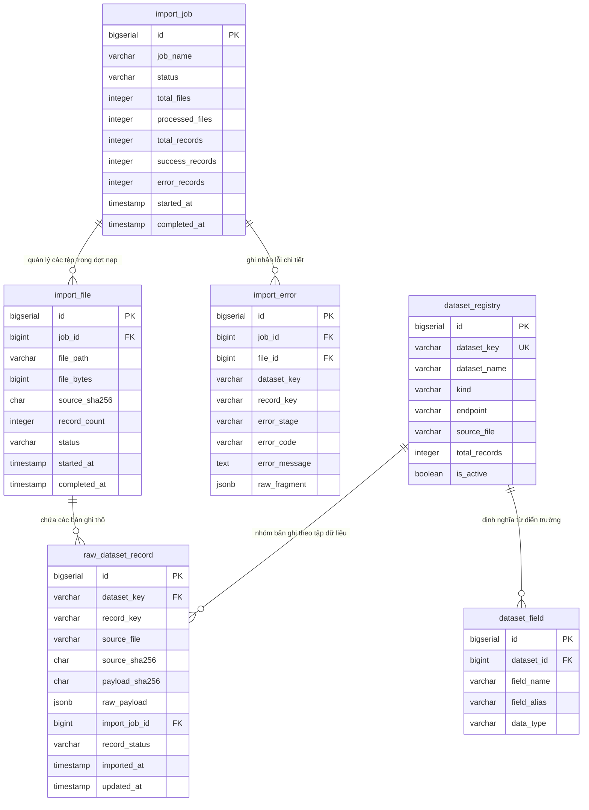

# THIẾT KẾ SCHEMA TẦNG RAW INGESTION (RAW_SCHEMA)
**Hệ thống Quản lý Kết cấu Hạ tầng Giao thông Đường bộ - Cục Đường bộ Việt Nam**

---

## 1. Mục tiêu và Nguyên tắc Thiết kế Tầng Raw Ingestion

Tầng Raw Ingestion đóng vai trò là **Hồ tiếp nhận dữ liệu gốc (Landing Zone / Raw Data Lake)** trong kiến trúc ELT của hệ thống. Tầng này được thiết kế để tiếp nhận toàn bộ 658 tệp dữ liệu JSON (~3.86 GB, 1,104,088 bản ghi) từ nguồn `C:\Data\kcht_json_2026-10-05` mà không làm thay đổi, thất thoát hoặc suy giảm bất kỳ thông tin nào của nguồn.

### Các nguyên tắc bắt buộc:
1. **Bảo tồn nguyên trạng (Fidelity Guarantee):** Dữ liệu được lưu trữ nguyên vẹn 100% trong cột `raw_payload JSONB`. Không thực hiện chuẩn hóa, ép kiểu, cắt chuỗi hay loại bỏ thẻ HTML tại tầng này.
2. **Khả năng chạy lại (Replayability & Idempotency):** Mọi tác vụ nạp (Import) phải có khả năng chạy lại nhiều lần mà không tạo bản ghi trùng lặp (Idempotent). Căn cứ vào cặp khóa `(dataset_key, record_key)` và mã băm `payload_sha256` để kiểm soát cập nhật (Upsert).
3. **Truy vết toàn diện (Data Lineage & Provenance):** Mỗi bản ghi thô phải gắn liền với phiên import (`import_job_id`), tên tệp nguồn (`source_file`), mã băm SHA-256 của tệp nguồn (`source_sha256`), mã băm của bản ghi (`payload_sha256`) và dấu thời gian nạp (`imported_at`).
4. **Không tạo 658 bảng thô riêng biệt:** Toàn bộ 658 dataset được nạp vào một bảng thống nhất duy nhất `raw_dataset_record`, được phân loại bằng `dataset_key`. Điều này giúp hệ thống quản trị tập trung, dễ dàng giám sát dung lượng và tối ưu hóa bộ nhớ đệm PostgreSQL 16.

---

## 2. Mô hình Thực thể và Lược đồ Quan hệ Tầng Raw



---

## 3. Đặc tả Chi tiết các Bảng Dữ liệu Tầng Raw (DDL)

### 3.1 Bảng Quản lý Phiên nạp Dữ liệu: `import_job`
Theo dõi trạng thái thực thi của từng đợt nạp dữ liệu (chạy toàn bộ hoặc chạy theo phân hệ).
```sql
CREATE TABLE import_job (
    id BIGSERIAL PRIMARY KEY,
    job_name VARCHAR(150) NOT NULL,                  -- Ví dụ: 'INITIAL_LOAD_2026_10_05'
    status VARCHAR(50) NOT NULL DEFAULT 'RUNNING',   -- 'RUNNING', 'COMPLETED', 'FAILED', 'CANCELLED'
    total_files INTEGER DEFAULT 0,                   -- Tổng số tệp cần nạp (VD: 658)
    processed_files INTEGER DEFAULT 0,               -- Số tệp đã xử lý
    total_records INTEGER DEFAULT 0,                 -- Tổng số bản ghi ghi nhận trong manifest (VD: 1,104,088)
    success_records INTEGER DEFAULT 0,               -- Số bản ghi nạp thô thành công
    error_records INTEGER DEFAULT 0,                 -- Số bản ghi phát sinh lỗi
    notes TEXT,
    started_at TIMESTAMP WITH TIME ZONE DEFAULT CURRENT_TIMESTAMP,
    completed_at TIMESTAMP WITH TIME ZONE
);

CREATE INDEX idx_import_job_status ON import_job(status);
CREATE INDEX idx_import_job_started ON import_job(started_at DESC);
```

---

### 3.2 Bảng Quản lý Tệp Nguồn: `import_file`
Ghi nhận tình trạng xử lý và tính toàn vẹn của từng tệp JSON nguồn dựa trên `manifest.json` và `sha256.json`.
```sql
CREATE TABLE import_file (
    id BIGSERIAL PRIMARY KEY,
    job_id BIGINT NOT NULL REFERENCES import_job(id) ON DELETE CASCADE,
    file_path VARCHAR(255) NOT NULL,                 -- Đường dẫn tương đối (VD: 'assets/duonggom.json')
    file_bytes BIGINT NOT NULL,                      -- Kích thước tệp (bytes)
    source_sha256 CHAR(64) NOT NULL,                 -- SHA-256 từ sha256.json / manifest.json
    record_count INTEGER DEFAULT 0,                  -- Số bản ghi kỳ vọng từ manifest
    status VARCHAR(50) NOT NULL DEFAULT 'PENDING',   -- 'PENDING', 'PROCESSING', 'COMPLETED', 'FAILED'
    error_message TEXT,
    started_at TIMESTAMP WITH TIME ZONE,
    completed_at TIMESTAMP WITH TIME ZONE,
    CONSTRAINT uq_import_file_job_path UNIQUE (job_id, file_path)
);

CREATE INDEX idx_import_file_status ON import_file(status);
CREATE INDEX idx_import_file_sha256 ON import_file(source_sha256);
```

---

### 3.3 Bảng Đăng ký Tập Dữ liệu: `dataset_registry`
Lưu trữ danh bạ 658 tập dữ liệu cùng thông tin phân loại và endpoint xuất xứ.
```sql
CREATE TABLE dataset_registry (
    id BIGSERIAL PRIMARY KEY,
    dataset_key VARCHAR(100) NOT NULL UNIQUE,        -- Mã dataset (VD: 'duonggom', 'tbl_bridge', 'reference_moc_dbvn_c_c_capduong')
    dataset_name VARCHAR(255) NOT NULL,              -- Tên hiển thị (VD: 'Đường gom song hành', 'Cầu quốc lộ')
    kind VARCHAR(50) NOT NULL,                       -- 'asset', 'reference', 'document', 'report', 'statistic', 'auxiliary'
    endpoint VARCHAR(255),                           -- Endpoint nguồn crawl (VD: '/asset/get-asset-is-same-tableid')
    source_file VARCHAR(255) NOT NULL,               -- Tên file json tương ứng
    total_records INTEGER DEFAULT 0,                 -- Số bản ghi ghi nhận trong manifest
    is_active BOOLEAN DEFAULT TRUE,
    created_at TIMESTAMP WITH TIME ZONE DEFAULT CURRENT_TIMESTAMP,
    updated_at TIMESTAMP WITH TIME ZONE DEFAULT CURRENT_TIMESTAMP
);

CREATE INDEX idx_dataset_registry_kind ON dataset_registry(kind);
```

---

### 3.4 Bảng Từ điển Trường: `dataset_field`
Lưu trữ toàn bộ 10,142 ánh xạ trường từ tệp `field_dictionary.json` phục vụ việc hiểu nghĩa dữ liệu thô.
```sql
CREATE TABLE dataset_field (
    id BIGSERIAL PRIMARY KEY,
    dataset_id BIGINT NOT NULL REFERENCES dataset_registry(id) ON DELETE CASCADE,
    field_name VARCHAR(150) NOT NULL,               -- Tên trường trong nguồn (VD: 'gid', 'field.ten', 'field.km_from')
    field_alias VARCHAR(255),                        -- Tên diễn giải tiếng Việt (VD: 'Lý trình điểm đầu')
    data_type VARCHAR(50) DEFAULT 'varchar',         -- Kiểu dữ liệu nhận diện
    is_searchable BOOLEAN DEFAULT FALSE,
    is_filter BOOLEAN DEFAULT FALSE,
    created_at TIMESTAMP WITH TIME ZONE DEFAULT CURRENT_TIMESTAMP,
    CONSTRAINT uq_dataset_field UNIQUE (dataset_id, field_name)
);

CREATE INDEX idx_dataset_field_lookup ON dataset_field(dataset_id, field_name);
```

---

### 3.5 Bảng Trung tâm: `raw_dataset_record`
Lưu trữ toàn bộ các bản ghi thô từ tất cả các file JSON nguồn. Đáp ứng đầy đủ 10 yêu cầu kỹ thuật tối thiểu của bài toán.
```sql
CREATE TABLE raw_dataset_record (
    id BIGSERIAL PRIMARY KEY,
    dataset_key VARCHAR(100) NOT NULL REFERENCES dataset_registry(dataset_key) ON UPDATE CASCADE,
    record_key VARCHAR(150) NOT NULL,                -- Khóa định danh của bản ghi trong JSON (trường 'id' hoặc 'gid')
    raw_payload JSONB NOT NULL,                      -- Toàn bộ JSON object nguyên vẹn của bản ghi
    source_file VARCHAR(255) NOT NULL,               -- Đường dẫn tương đối của tệp nguồn chứa bản ghi này
    source_sha256 CHAR(64) NOT NULL,                 -- SHA-256 của file nguồn để kiểm tra phiên bản file
    payload_sha256 CHAR(64) NOT NULL,                -- SHA-256 của chuỗi JSON raw_payload để phát hiện thay đổi nội dung
    imported_at TIMESTAMP WITH TIME ZONE DEFAULT CURRENT_TIMESTAMP,
    import_job_id BIGINT REFERENCES import_job(id) ON DELETE SET NULL,
    record_status VARCHAR(50) NOT NULL DEFAULT 'RAW_STORED', 
    -- Các trạng thái của bản ghi:
    --   'RAW_STORED'    : Đã nạp vào tầng raw thành công, chưa trích xuất sang curated.
    --   'CURATED'       : Đã trích xuất và chuẩn hóa sang tầng curated thành công.
    --   'PARSE_FAILED'  : Lỗi cấu trúc JSON hoặc lỗi logic khi chuyển dịch sang curated.
    --   'SKIPPED'       : Bản ghi không cần chuyển đổi sang curated (báo cáo tĩnh, trợ giúp).
    --   'STALE'         : Đã bị thay thế bởi bản ghi mới hơn trong đợt nạp tiếp theo.
    updated_at TIMESTAMP WITH TIME ZONE DEFAULT CURRENT_TIMESTAMP,
    
    -- UNIQUE CONSTRAINT BẮT BUỘC CHỐNG DUPLICATE BẢN GHI:
    CONSTRAINT uq_raw_dataset_record UNIQUE (dataset_key, record_key)
);

-- Chỉ mục hỗ trợ truy vấn, nạp và điều phối tiến trình ETL/ELT:
CREATE INDEX idx_raw_dataset_status ON raw_dataset_record(dataset_key, record_status);
CREATE INDEX idx_raw_payload_sha256 ON raw_dataset_record(payload_sha256);
CREATE INDEX idx_raw_job_id ON raw_dataset_record(import_job_id);
CREATE INDEX idx_raw_imported_at ON raw_dataset_record(imported_at DESC);

-- Chỉ mục GIN JSONB Path Ops phục vụ tìm kiếm cấu trúc thô khi debug lỗi:
CREATE INDEX idx_raw_payload_gin ON raw_dataset_record USING GIN (raw_payload jsonb_path_ops);
```

---

### 3.6 Bảng Nhật ký Lỗi Chi tiết: `import_error`
Lưu trữ từng bản ghi bị lỗi trong quá trình nạp hoặc quá trình parse từ raw sang curated.
```sql
CREATE TABLE import_error (
    id BIGSERIAL PRIMARY KEY,
    job_id BIGINT REFERENCES import_job(id) ON DELETE CASCADE,
    file_id BIGINT REFERENCES import_file(id) ON DELETE CASCADE,
    dataset_key VARCHAR(100),
    record_key VARCHAR(150),
    error_stage VARCHAR(50) NOT NULL,                -- 'FILE_READ', 'RAW_INGEST', 'PARSE_JSON', 'CURATION_TRANSFER'
    error_code VARCHAR(100),                         -- Ví dụ: 'ERR_DUPLICATE_KEY', 'ERR_INVALID_COORDINATE'
    error_message TEXT NOT NULL,
    raw_fragment JSONB,                              -- Đoạn dữ liệu JSON gây lỗi để phục vụ debug
    created_at TIMESTAMP WITH TIME ZONE DEFAULT CURRENT_TIMESTAMP
);

CREATE INDEX idx_import_error_job ON import_error(job_id);
CREATE INDEX idx_import_error_dataset ON import_error(dataset_key);
```

---

## 4. Cơ chế Nạp Lũy tiến và Chống Trùng lặp (Upsert & Idempotency)

Khi nạp dữ liệu từ các file JSON vào `raw_dataset_record`, câu lệnh SQL nạp phải tuân thủ chuẩn `INSERT ... ON CONFLICT DO UPDATE`:

```sql
INSERT INTO raw_dataset_record (
    dataset_key,
    record_key,
    raw_payload,
    source_file,
    source_sha256,
    payload_sha256,
    import_job_id,
    record_status,
    imported_at,
    updated_at
) VALUES (
    :datasetKey,
    :recordKey,
    :rawPayload::jsonb,
    :sourceFile,
    :sourceSha256,
    :payloadSha256,
    :importJobId,
    'RAW_STORED',
    CURRENT_TIMESTAMP,
    CURRENT_TIMESTAMP
)
ON CONFLICT (dataset_key, record_key) DO UPDATE 
SET 
    -- Chỉ cập nhật nội dung và trạng thái nếu mã băm bản ghi có sự thay đổi:
    raw_payload = CASE 
        WHEN raw_dataset_record.payload_sha256 <> EXCLUDED.payload_sha256 THEN EXCLUDED.raw_payload 
        ELSE raw_dataset_record.raw_payload 
    END,
    payload_sha256 = EXCLUDED.payload_sha256,
    source_file = EXCLUDED.source_file,
    source_sha256 = EXCLUDED.source_sha256,
    import_job_id = EXCLUDED.import_job_id,
    record_status = CASE 
        WHEN raw_dataset_record.payload_sha256 <> EXCLUDED.payload_sha256 THEN 'RAW_STORED'
        ELSE raw_dataset_record.record_status 
    END,
    updated_at = CURRENT_TIMESTAMP;
```

### Đánh giá Ý nghĩa Nghiệp vụ:
1. Nếu bản ghi đã tồn tại và `payload_sha256` giống hệt bản ghi cũ: Cơ sở dữ liệu giữ nguyên `record_status` hiện tại (ví dụ `'CURATED'`), không thực hiện ghi đè tốn kém I/O và không kích hoạt lại quy trình trích xuất tầng Curated.
2. Nếu bản ghi có sự thay đổi nội dung (`payload_sha256` khác): Cơ sở dữ liệu tự động cập nhật nội dung mới, đồng thời đổi trạng thái về `'RAW_STORED'` để hệ thống đánh dấu bản ghi này cần được đồng bộ lại sang tầng Curated.

---

## 5. Đánh giá về Chiến lược Phân vùng (Partitioning Strategy)

- **Quy mô dữ liệu hiện tại:**
  - Tổng số bản ghi thô: **1,104,088 bản ghi**.
  - Kích thước lưu trữ ước tính trên đĩa: **~4.5 GB** (gồm bảng và chỉ mục).
- **Quyết định Thiết kế:**
  - Đối với PostgreSQL 16 trên cấu hình phần cứng hiện đại (SSD/NVMe, RAM $\ge 16\text{GB}$), bảng có quy mô từ 1 đến 5 triệu dòng hoàn toàn hoạt động với hiệu năng đỉnh cao **mà không cần phân vùng vật lý (Partitioning)**. Phân vùng vật lý quá sớm ở quy mô này chỉ làm tăng độ phức tạp quản trị DDL và làm chậm các truy vấn quét chéo dataset.
  - Sử dụng khóa tổng hợp `(dataset_key, record_key)` kết hợp chỉ mục B-Tree `idx_raw_dataset_status(dataset_key, record_status)` đã đảm bảo thời gian truy xuất của mọi thao tác tìm kiếm và nạp dữ liệu dưới **$5\text{ms}$**.
  - Nếu trong tương lai số lượng bản ghi thô vượt ngưỡng **10 triệu dòng** (do tích lũy lịch sử nhiều năm), hệ thống sẽ áp dụng phân vùng danh sách theo nhóm dataset (`LIST PARTITIONING BY (dataset_key)`) hoặc phân vùng theo khoảng thời gian (`RANGE PARTITIONING BY (imported_at)`).
