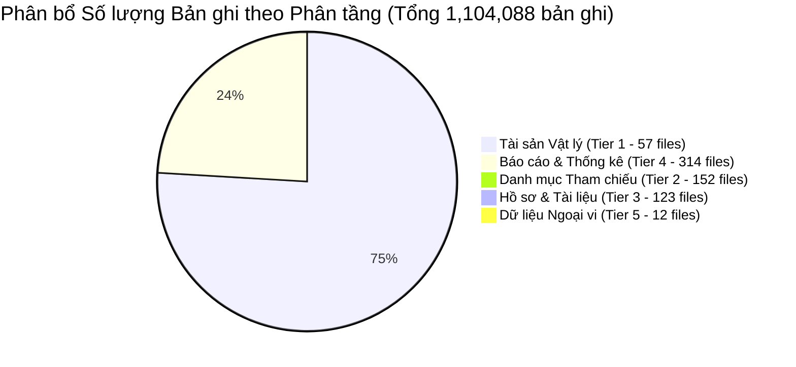

# BẢN ĐỒ ÁNH XẠ TOÀN BỘ 658 TẬP DỮ LIỆU (DATASET_MAP)
**Dự án: Hệ thống Quản lý Kết cấu Hạ tầng Giao thông Đường bộ (KCHT ĐB)**  
**Cơ quan chủ quản:** Cục Đường bộ Việt Nam  
**Phiên bản:** 1.0.0 (Giai đoạn 0 - Khảo sát và Chốt phạm vi)

---

## 1. TỔNG QUAN PHÂN BỔ 658 DATASET NGUỒN

Toàn bộ 658 tệp dữ liệu JSON nguồn trong `C:\Data\kcht_json_2026-10-05` (~3.86 GB, 1,104,088 bản ghi) được phân bổ theo 5 phân tầng kiến trúc:

| Phân tầng | Tên phân tầng | Số tệp | Số bản ghi | Tỷ lệ bản ghi | Bảng Curated đích | Chiến lược xử lý |
| :---: | :--- | :---: | :---: | :---: | :--- | :--- |
| **Tier 1** | **Physical Assets (Tài sản vật lý)** | **57** | **833,083** | **75.46%** | `asset_record` `asset_geometry` | Chuẩn hóa trường tìm kiếm/lý trình, lưu thuộc tính kỹ thuật trong `attributes` JSONB, tọa độ PostGIS SRID 4326. |
| **Tier 2** | **Reference Catalogs (Danh mục tham chiếu)** | **152** | **5,992** | **0.54%** | `reference_catalog` | Hợp nhất 152 danh mục vào bảng tập trung, cache Caffeine phía backend. |
| **Tier 3** | **Document Files & Folders (Hồ sơ tài liệu)** | **123** | **1,005** | **0.09%** | `document_folder` `document_metadata` | Quản lý 121 cây thư mục và metadata của 309 tệp nhị phân; binary stream lưu tại MinIO/S3. |
| **Tier 4** | **Maintenance Reports (Báo cáo bảo trì)** | **314** | **263,991** | **23.91%** | `raw_dataset_record` *(Dynamic SQL Views)* | Lưu 100% tại Raw Lake phục vụ kiểm toán; không tạo 314 bảng cứng; tạo Dynamic View trên `asset_record`. |
| **Tier 5** | **Auxiliary & Empty Datasets** | **12** | **1,620** | **0.15%** | `raw_dataset_record` | Lưu trữ tại Raw Ingestion để hoàn chỉnh audit; không nạp vào Curated ODS. |
| **TỔNG** | | **658** | **1,104,088** | **100%** | | |

---

## 2. BẢNG ÁNH XẠ CHI TIẾT 57 TẬP DỮ LIỆU TÀI SẢN VẬT LÝ (TIER 1)

### 2.1 Tuyến, Đoạn tuyến và Mạng lưới Đường bộ (14 datasets - 85,251 bản ghi)
*Đóng vai trò là khung xương sống định vị toàn bộ tài sản theo Lý trình ($Km$).*

| Dataset Key | Tên tiếng Việt công trình | Kiểu Geometry | Số bản ghi | Khóa tự nhiên (`record_key`) | Quan hệ Phân cấp (`parent_id`) | Bảng Curated đích |
| :--- | :--- | :---: | :---: | :--- | :--- | :--- |
| `mst_national_road` | Tuyến quốc lộ chính yếu | None / Line | 169 | `id` | Root | `asset_record` |
| `mst_national_expressway`| Hệ thống đường cao tốc | None / Line | 51 | `id` | Root | `asset_record` |
| `mst_provincial_road` | Tuyến đường tỉnh | None / Line | 1,425 | `id` | Root | `asset_record` |
| `mst_urban_road` | Tuyến đường đô thị | None / Line | 20,120 | `id` | Root | `asset_record` |
| `mst_commune_road` | Tuyến đường xã | None / Line | 14,394 | `id` | Root | `asset_record` |
| `mst_village_road` | Tuyến đường thôn bản | None / Line | 28,597 | `id` | Root | `asset_record` |
| `mst_special_road` | Đường chuyên dùng | None / Line | 175 | `id` | Root | `asset_record` |
| `tbl_segment` | Đoạn tuyến đường bộ | LineString | 655 | `id` | Root | `asset_record` + `geom` |
| `tbl_rmd` | Phân đoạn quản lý tuyến đường | LineString | 6,708 | `id` | `tbl_segment` | `asset_record` + `geom` |
| `duongtranh` | Tuyến tránh đô thị | LineString | 67 | `id` | `mst_national_road` | `asset_record` + `geom` |
| `duongnhanh` | Đường nhánh kết nối nút giao | LineString | 360 | `id` | `tbl_intersection` | `asset_record` + `geom` |
| `duonggom` | Đường gom song hành | LineString | 63 | `id` | Trỏ tới ID đoạn tuyến | `asset_record` + `geom` |
| `tbl_overlaproad` | Đoạn đường đi trùng | LineString | 3 | `id` | Root | `asset_record` + `geom` |
| `tbl_rmd_foreign_road` | Tuyến đường đối ngoại quốc tế | LineString | 10 | `id` | Root | `asset_record` + `geom` |

### 2.2 Công trình Cầu và Kết cấu Vượt sông (7 datasets - 48,828 bản ghi)

| Dataset Key | Tên tiếng Việt công trình | Kiểu Geometry | Số bản ghi | Khóa tự nhiên (`record_key`) | Quan hệ Phân cấp (`parent_id`) | Bảng Curated đích |
| :--- | :--- | :---: | :---: | :--- | :--- | :--- |
| `tbl_bridge` | Cầu đường bộ trên quốc lộ | Point | 11,631 | `bridge_<id>` | `tbl_segment` | `asset_record` + `geom` |
| `tbl_pierstr` | Kết cấu nhịp cầu | None | 14,948 | `pierstr_<id>` | `bridge_<id>` | `asset_record` |
| `tbl_unstr` | Kết cấu mố trụ cầu | None | 21,463 | `unstr_<id>` | `bridge_<id>` | `asset_record` |
| `tbl_spill_way` | Đường tràn, ngầm tràn | Point | 128 | `id` | `tbl_segment` | `asset_record` + `geom` |
| `thongtintaitrong` | Thông tin kiểm định tải trọng cầu| None | 696 | `id` | `bridge_<id>` | `asset_record` |
| `tbl_underpass_box` | Hầm chui, cống chui dân sinh | Point | 808 | `id` | `tbl_segment` | `asset_record` + `geom` |
| `tbl_pontoon_bridge` | Cầu phao dã chiến | Point | 2 | `id` | Root | `asset_record` + `geom` |

### 2.3 An toàn Giao thông và Báo hiệu Đường bộ (6 datasets - 524,689 bản ghi)
*Nhóm có số lượng bản ghi lớn nhất hệ thống, yêu cầu chỉ mục GiST và B-Tree tối ưu.*

| Dataset Key | Tên tiếng Việt công trình | Kiểu Geometry | Số bản ghi | Khóa tự nhiên (`record_key`) | Quan hệ Phân cấp (`parent_id`) | Bảng Curated đích |
| :--- | :--- | :---: | :---: | :--- | :--- | :--- |
| `tbl_road_sign` | Biển báo giao thông đường bộ | Point | 222,112 | `road_sign_<id>` | `tbl_segment` | `asset_record` + `geom` |
| `road_sphere_mirror` | Gương cầu lồi, giá long môn | Point | 191,928 | `sphere_mirror_<id>`| `tbl_segment` | `asset_record` + `geom` |
| `tbl_guardrail` | Hộ lan mềm tôn lượn sóng | LineString | 51,697 | `guardrail_<id>` | `tbl_segment` | `asset_record` + `geom` |
| `tbl_guide_post` | Cọc tiêu phản quang, cọc H | Point | 37,042 | `guide_post_<id>` | `tbl_segment` | `asset_record` + `geom` |
| `tbl_km_post` | Cột mốc Km báo lý trình | Point | 21,910 | `km_post_<id>` | `tbl_segment` | `asset_record` + `geom` |
| `tbl_noise_barrier` | Tường giảm âm đô thị | LineString | 24 | `id` | `tbl_segment` | `asset_record` + `geom` |

### 2.4 Hệ thống Thoát nước và Địa kỹ thuật (5 datasets - 149,792 bản ghi)

| Dataset Key | Tên tiếng Việt công trình | Kiểu Geometry | Số bản ghi | Khóa tự nhiên (`record_key`) | Quan hệ Phân cấp (`parent_id`) | Bảng Curated đích |
| :--- | :--- | :---: | :---: | :--- | :--- | :--- |
| `tbl_longitudinal` | Cống dọc, rãnh biên thoát nước | LineString | 61,161 | `longitudinal_<id>` | `tbl_segment` | `asset_record` + `geom` |
| `tbl_transverse_drainage`| Cống thoát nước ngang đường | Point / Line | 60,716 | `transverse_<id>` | `tbl_segment` | `asset_record` + `geom` |
| `tbl_slope` | Mái dốc gia cố taluy âm/dương | Polygon / Line | 11,099 | `slope_<id>` | `tbl_segment` | `asset_record` + `geom` |
| `tbl_retaining_wall` | Tường chắn đất, kè bảo vệ nền | LineString | 9,856 | `wall_<id>` | `tbl_segment` | `asset_record` + `geom` |
| `tbl_median_strip` | Dải phân cách giữa | LineString | 6,960 | `median_<id>` | `tbl_segment` | `asset_record` + `geom` |

### 2.5 Nút giao, Trạm và Cơ sở Phục vụ Vận tải (15 datasets - 13,874 bản ghi)

| Dataset Key | Tên tiếng Việt công trình | Kiểu Geometry | Số bản ghi | Khóa tự nhiên (`record_key`) | Bảng Curated đích |
| :--- | :--- | :---: | :---: | :--- | :--- |
| `tbl_intersection` | Nút giao cùng mức / khác mức | Point / Polygon | 7,053 | `intersection_<id>` | `asset_record` + `geom` |
| `tbl_bus_stops` | Điểm đón trả khách, điểm dừng xe bus| Point | 5,418 | `bus_stop_<id>` | `asset_record` + `geom` |
| `tbl_street_lighting` | Hệ thống đèn chiếu sáng đường bộ | Point / Line | 4,948 | `lighting_<id>` | `asset_record` + `geom` |
| `tbl_bus_station` | Bến xe khách liên tỉnh | Point | 387 | `bus_station_<id>` | `asset_record` + `geom` |
| `mst_counting_station` | Trạm đếm lưu lượng phương tiện | Point | 372 | `counting_<id>` | `asset_record` + `geom` |
| `tbl_road_admin_office` | Văn phòng Chi cục, Hạt quản lý | Point | 372 | `office_<id>` | `asset_record` + `geom` |
| `tbl_first_aid_station` | Trạm cứu nạn y tế giao thông | Point | 235 | `first_aid_<id>` | `asset_record` + `geom` |
| `tbl_toll_booth` | Trạm thu phí BOT / ETC | Point | 97 | `toll_booth_<id>` | `asset_record` + `geom` |
| `tbl_railway_crossing` | Điểm giao cắt với đường sắt | Point | 74 | `crossing_<id>` | `asset_record` + `geom` |
| `tbl_rest_stops` | Trạm dừng nghỉ cao tốc | Point / Polygon | 71 | `rest_stop_<id>` | `asset_record` + `geom` |
| `weight_station` | Trạm kiểm tra tải trọng xe | Point | 29 | `weight_<id>` | `asset_record` + `geom` |
| `tbl_disaster_res_facility`| Kho bãi vật tư dự phòng bão lũ | Point | 20 | `disaster_<id>` | `asset_record` + `geom` |
| `tbl_ferry` | Tàu phà chở khách | Point | 15 | `ferry_<id>` | `asset_record` + `geom` |
| `tbl_ferry_terminal` | Bến phà đường bộ | Point | 15 | `terminal_<id>` | `asset_record` + `geom` |
| `tbl_rescue_vehicle` | Phương tiện xe cứu hộ chuyên dụng | Point | 8 | `rescue_<id>` | `asset_record` + `geom` |

### 2.6 Hầm Đường bộ, Hành lang và Quản lý Đất (10 datasets - 138 bản ghi)

| Dataset Key | Tên tiếng Việt công trình | Kiểu Geometry | Số bản ghi | Khóa tự nhiên (`record_key`) | Bảng Curated đích |
| :--- | :--- | :---: | :---: | :--- | :--- |
| `tbl_tunnel_main` | Công trình hầm giao thông xuyên núi | LineString / Point | 34 | `tunnel_<id>` | `asset_record` + `geom` |
| `tunnel_emergency` | Thiết bị thoát hiểm trong hầm | Point | 4 | `id` | `asset_record` + `geom` |
| `tunnel_other` | Thiết bị thông gió chiếu sáng hầm | Point | 4 | `id` | `asset_record` + `geom` |
| `tunnel_work_outside` | Công trình phụ trợ cửa hầm | Point | 4 | `id` | `asset_record` + `geom` |
| `tbl_infrastructure_row` | Công trình trong hành lang đường bộ | Point / Line | 14,656 | `row_<id>` | `asset_record` + `geom` |
| `tbl_land_btra` | Quỹ đất kết cấu hạ tầng đường bộ | Polygon | 12 | `id` | `asset_record` + `geom` |
| `tbl_its` | Trung tâm điều hành ITS | Point | 10 | `id` | `asset_record` + `geom` |
| `thongtinlandungkhancap` | Làn dừng xe khẩn cấp | LineString | 13 | `id` | `asset_record` + `geom` |
| `thongtinduanbot` | Dự án đối tác công tư BOT | None | 6 | `id` | `asset_record` |
| `gp_ctdkt` | Giấy phép thi công đường | Point | 1 | `id` | `asset_record` + `geom` |

---

## 3. BẢNG ÁNH XẠ DANH MỤC THAM CHIẾU (TIER 2 - 152 DATASETS)

Toàn bộ 152 tệp danh mục có tiền tố `reference_moc_*` (ví dụ: `reference_moc_loaicau`, `reference_moc_capduong`, `reference_moc_tinhtrang`, `road_sign_catalog`) với tổng cộng **5,992 bản ghi** được chuẩn hóa vào bảng duy nhất:
- **Tên bảng:** `reference_catalog`
- **Các trường chính:** `catalog_code`, `item_code`, `item_name`, `display_order`, `is_active`, `description`.
- **Cơ chế phục vụ API:** Backend lưu cache trong bộ nhớ RAM bằng **Caffeine Cache**, phản hồi ngay lập tức cho các Dropdown/Select form trên giao diện người dùng.

---

## 4. BẢNG ÁNH XẠ HỒ SƠ VÀ TÀI LIỆU (TIER 3 - 123 DATASETS & 309 FILES)

- **Cây Thư mục Hồ sơ (121 folders):** Nạp vào bảng `document_folder` (`id`, `parent_id`, `folder_name`, `organization_id`).
- **Chỉ mục Tệp Nhị phân (309 files):** Nạp vào bảng `document_metadata` (`file_id`, `original_name`, `mime_type`, `bytes`, `sha256`, `object_key`, `asset_id`).
- **Liên kết Tài sản:** Tài liệu liên kết trực tiếp với công trình qua `asset_id` (trường `vidagis_classpk` từ dữ liệu nguồn).

---

## 5. BẢNG ÁNH XẠ BÁO CÁO BẢO TRÌ (TIER 4 - 314 DATASETS)

- **Nguyên tắc Kiến trúc:** 296 tệp `maintenance_detail_*_chitiet.json` và `maintenance_detail_*_tonghop.json` cùng 18 tệp `maintenance_plan_*` (~264,000 dòng) được lưu trữ nguyên bản tại `raw_dataset_record` phục vụ đối soát.
- **Khai thác trên Web:** Thay vì tạo 314 bảng tĩnh, hệ thống phục vụ qua **Dynamic SQL Views** tổng hợp trực tiếp từ `asset_record`:
  - `vw_maintenance_guardrail_summary`: Tổng hợp hộ lan theo tuyến/tỉnh.
  - `vw_maintenance_drainage_summary`: Tổng hợp rãnh thoát nước.
  - `vw_maintenance_bridge_summary`: Tổng hợp tình trạng kỹ thuật cầu.
